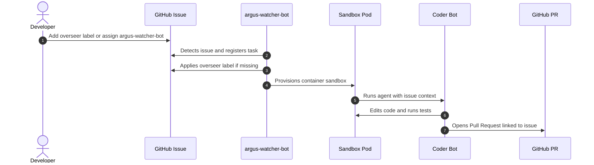
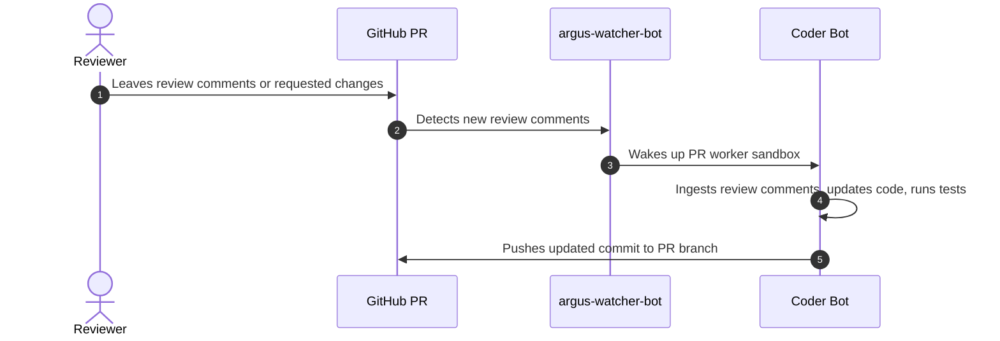
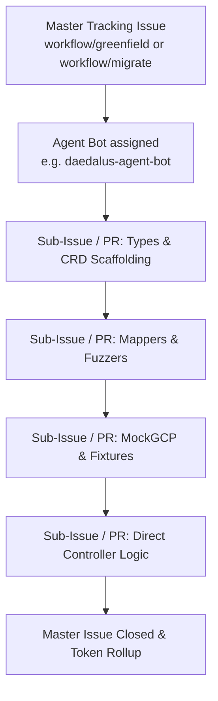

# Interacting with Overseer: A Developer's Guide to AI-Assisted Engineering in KCC

This guide explains how software engineers working on the `k8s-config-connector` repository interact with **Overseer**, our automation and agentic engineering system running in Kubernetes.

Overseer helps contributors triage issues, fix bugs, generate MockGCP test fixtures, build direct controllers, and iterate on pull request reviews.

### What Overseer Can Help With
1. **Bug Fixing and Troubleshooting**: Triage and resolve individual bug reports, test drift failures, and parameter adjustments. Examples: [Issue #10460](https://github.com/GoogleCloudPlatform/k8s-config-connector/issues/10460) and [Issue #11946](https://github.com/GoogleCloudPlatform/k8s-config-connector/issues/11946).
2. **Brownfield Migrations**: Migrate existing Terraform/DCL resources to native Kubernetes controller-runtime reconcilers (the **Direct approach**) using staged pipelines.
3. **Greenfield Development**: Scaffold new Google Cloud Platform (GCP) custom resource definitions (CRDs), mock tests, and direct controllers.

---

## 1. Bot Accounts and Roles

Overseer uses dedicated GitHub bot accounts with distinct responsibilities (configured in [overseer/examples/kcc.yaml](https://github.com/GoogleCloudPlatform/k8s-config-connector/blob/master/overseer/examples/kcc.yaml)):

| Bot Role | Accounts | Primary Responsibility |
| :--- | :--- | :--- |
| **Watcher Bot** | `argus-watcher-bot` | Central supervisor and scheduler. Scans issues, PRs, and `.agents/` chore configs, assigns work to sandboxes, and coordinates workflows. |
| **Coder Bots** | `hopper-coder-bot`, `ada-coder-bot`, `neumann-coder-bot`, `lovelace-coder-bot` | Hands-on code development. Clones the repo in a Kubernetes sandbox, writes code, runs presubmits (`make fmt`, `go test`), and opens/updates PRs. |
| **Reviewer Bot** | `reviewbot-robot` | Automated PR reviewer that evaluates diffs and provides structural feedback. |
| **Agent Bots** | `daedalus-agent-bot`, `feynman-agent-bot`, `walle-agent-bot` | Orchestrators for multi-step workflows (e.g. greenfield/migration pipelines) and repository maintenance chores (`.agents/`). |

### Why Coder Bots and Agent Bots are Separated
- **Coder Bots** are tightly scoped to a single branch and PR. They make code modifications, run builds/tests, and push git commits. They do not make widespread GitHub API calls across the repository.
- **Agent Bots** coordinate work across multiple issues and PRs (e.g., decomposing a master workflow issue into sub-issues and tracking milestone progress). They rarely push code directly (except for specific chores like release bumps) and are GitHub API-heavy.
- **Isolation**: Separating these roles prevents GitHub API rate limits or temporary token throttling encountered during repository-wide coordination from affecting Coder Bots actively pushing PR updates.

---

## 2. Engaging via Issues: Labels and Assignees

You can trigger Overseer on an issue using either labels or direct assignment.

### How to Trigger Overseer on an Issue

You only need to perform **one** of the following actions:

1. **Apply the Label**: Add the `overseer` label to the GitHub issue.
   - *Expected latency*: ~30 mins–1 hour (picked up during the periodic polling cycle).
2. **Assign the Watcher Bot**: Assign the issue to **`argus-watcher-bot`**.
   - *Expected latency*: ~20 mins (faster pickup).
   - *Important*: Do **not** assign issues directly to Coder Bots (`hopper-coder-bot`, etc.) or Agent Bots. Coder bots do not poll issues directly and require `argus-watcher-bot` to schedule and provision the sandbox task. Assigning a coder bot directly will bypass the scheduler and fail to run.



### Expected Turnaround Times

| Phase | Expected Time | Notes |
| :--- | :--- | :--- |
| **Issue Detection** | ~20 min (assigned) / ~30 min–1 hour (labeled) | `argus-watcher-bot` enqueues the task. |
| **Sandbox Provisioning** | 1–2 min | Worker pod spins up with pre-warmed Go tooling and test credentials. |
| **Code Generation & Testing** | 15–30 min | Agent develops code, runs local tests (`make fmt`, unit tests, e2e samples). |
| **PR Opened** | Immediately after tests pass | A Coder Bot opens a PR with the `overseer` label and links to the issue. |

> **Note on Issue Filtering**: Overseer ignores issues numbered below `9000` (`minNumber: 9000`) to avoid processing legacy backlog items. Ensure your issue number is 9000 or higher.

### Recommended Issue Structure

Structuring your issue clearly helps Overseer identify the scope, locate relevant code, and generate accurate fixes quickly.

#### Bug Reports & Targeted Fixes
*Real-world examples: [Issue #10460](https://github.com/GoogleCloudPlatform/k8s-config-connector/issues/10460), [Issue #11946](https://github.com/GoogleCloudPlatform/k8s-config-connector/issues/11946)*

```markdown
### Summary
Brief description of the issue or bug.

### Affected Resource
- Kind: `StorageBucket` (or GVK)
- API Version: `storage.cnrm.cloud.google.com/v1beta1`

### Steps to Reproduce / Resource YAML
```yaml
apiVersion: storage.cnrm.cloud.google.com/v1beta1
kind: StorageBucket
metadata:
  name: sample-bucket
spec:
  # ...
```

### Expected vs Actual Behavior
- **Expected**: Resource reconciles to Ready.
- **Actual**: Reconciler fails with error: `...`

### References / Links
- Link to relevant GCP API docs or error logs.
```

#### Workflow & Resource Migration Requests
*Real-world examples: [Issue #10694](https://github.com/GoogleCloudPlatform/k8s-config-connector/issues/10694), [Issue #11228](https://github.com/GoogleCloudPlatform/k8s-config-connector/issues/11228)*

```markdown
### Resource
- GCP Service: `spanner`
- Resource Kind: `SpannerBackupSchedule`
- Target API Version: `v1beta1`

### Objective
Migrate the resource from legacy TF/DCL to direct reconciler (or scaffold greenfield resource).

### References
- GCP API Documentation: https://cloud.google.com/spanner/docs/...
- Upstream Proto / REST API reference.
```

---

## 3. Engaging via Pull Requests: Review and Iteration

Once a PR is opened by a Coder Bot (or an existing PR is labeled with `overseer`), Overseer monitors the PR to run validations, fix test failures, and address code review comments.

### Automated Actions on PRs
- **Automated Test Failure Resolution**: If presubmit CI checks or unit tests fail, Overseer inspects the failure logs, spins up the worker sandbox, and pushes fixes.
- **Automated Conflict Resolution**: If updates to `master` cause merge conflicts, Overseer rebases the branch and resolves standard conflicts.
- **Automated Code Review (Selective)**: For select PRs based on configuration, `reviewbot-robot` provides initial feedback aligned with KCC review skills in `.gemini/skills/` (such as `reviewgen-greenfield-controller` and `reviewgen-brownfield-new-types`).
- **Human Handover (`ready-for-human`)**: Once automated validations pass, the bot applies the `ready-for-human` label. The automated review assigner chore ([.agents/review-assigner.md](https://github.com/GoogleCloudPlatform/k8s-config-connector/blob/master/.agents/review-assigner.md)) periodically balances and assigns these PRs to maintainers on the `k8s-config-connector-team`.



### How to Request Changes on a PR

When reviewing a PR opened by a Coder Bot:

1. **Leave your review comments** directly on the PR (inline code review comments or general discussion comments).
2. **Ensure the `overseer` label is present** on the PR (Coder Bots automatically attach this label when opening the PR).

> **Note on Assignees**: Applying the `overseer` label is the primary and recommended trigger. If you prefer using assignees, assign strictly back to the **authoring Coder Bot** that created the PR (e.g. `hopper-coder-bot`), as other accounts lack git push permissions to the PR branch.

### Expected PR Turnaround Times

| Action | Expected Time | Notes |
| :--- | :--- | :--- |
| **Review Detection** | 5–15 min | Triggered by new comments posted after the latest commit. |
| **Code Updates & Verification** | 10–25 min | The bot applies requested changes, runs `make fmt`, and runs relevant test suites. |
| **PR Push** | Immediately after tests pass | New commit pushed to the PR branch. |

### Troubleshooting PRs

- **Review comments not being addressed**: Overseer triggers a review task when it detects comments posted *after* the latest commit. If an automated push (such as a CI fix or rebase) occurred after your review comment, the bot may not recognize pending comments. Simply post a brief follow-up comment asking the bot to address the open review comments.
- **Forcing a rebase**: Leave a comment with `rebase` on the PR to trigger a rebase against `master` and rerun presubmit validations.
- **Stopping automation on a PR**: Add the `overseer/stop` label to the PR or issue to pause all Overseer activity.
- **Abandoning a stuck PR**: If a PR is stuck in unresolvable conflicts, close the PR. As long as the parent issue remains open and labeled `overseer`, a fresh PR will be generated in the next cycle.

---

## 4. Multi-Step Workflows: Greenfield & Brownfield Migrations

Building a new resource (**Greenfield**) or migrating an existing Terraform/DCL controller to direct reconcilers (**Brownfield**) involves multiple phases (scaffolding types, mappers, mock tests, controllers, and golden logs). Overseer handles this through **Staged Workflows**.



### Triggering a Workflow

1. Create a master tracking issue describing the target GCP resource.
2. Apply the `overseer` label and the appropriate workflow label:
   - **`workflow/greenfield`**: For new GCP resource APIs.
   - **`workflow/migrate`**: For migrating existing resources to direct controllers.

`argus-watcher-bot` automatically discovers the issue and schedules an agent bot to begin the staged pipeline.

Example workflow tracking issues:
- [Issue #10694](https://github.com/GoogleCloudPlatform/k8s-config-connector/issues/10694)
- [Issue #11228](https://github.com/GoogleCloudPlatform/k8s-config-connector/issues/11228)

### How Progress is Tracked
- **GitHub Issue Updates**: Progress is tracked directly on the master tracking issue via checklist items, sub-issues, and status comments.
- **Branch Journaling**: For multi-day workflows, Overseer records milestone checkpoints in a progress journal (e.g., `session-<resource>-migration.md`) committed to the `overseer` branch.
- **Token Usage Summary**: When all stages merge and the master issue is closed, a summary comment is posted with total token usage and iteration metrics.

---

## 5. Background Maintenance Chores (`.agents/*.md`)

Overseer also runs background maintenance routines defined in `.agents/`:

- **Review Assigner (`.agents/review-assigner.md`)**: Runs every 30 minutes to balance review load among `k8s-config-connector-team` members, matching reviewers based on workflow continuity.
- **KCC Release Engine (`.agents/kcc-release.md`)**: Watches version milestone tags (`v1.x.x`) to automate version bump PRs and release notes.
- **Mock Drift Correction (`.agents/mock-drift-correction.md`)** *(periodic/disabled)*: Identifies drift between MockGCP and live GCP API traffic logs.
- **Dependency & License Audits (`.agents/dependency-agent.md`, `license-agent.md`)**: Updates Go dependencies and validates license headers.

---

## 6. Quick Reference Checklist

- [ ] **Issue ID `>= 9000`**: Check that the GitHub issue number is 9000 or higher.
- [ ] **Trigger Automation**: Add the `overseer` label OR assign `argus-watcher-bot`.
- [ ] **Address PR Reviews**: Add review comments and ensure the PR is labeled `overseer` (or assigned to the authoring Coder Bot).
- [ ] **Workflows**: Use `workflow/greenfield` or `workflow/migrate` for multi-stage resource development.
- [ ] **Pause Automation**: Add `overseer/stop` if you want Overseer to halt work on an issue or PR.

