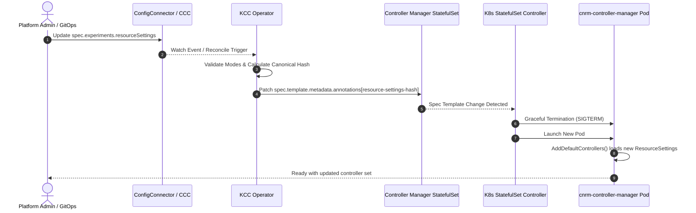

# Design Doc: Automatic Manager Pod Restart for Partial CRD (Controlled CR Reconciliation)

**Status:** Proposed  
**Authors:** KCC Team  
**Last Updated:** 2026-08-28  

---

## 1. Overview

Config Connector (KCC) supports **Controlled CR Reconciliation** (also referred to as **Partial CRD** mode), which allows cluster and platform administrators to selectively enable or disable reconciliation for specific GCP resource groups and kinds using the `spec.experiments.resourceSettings` field in `ConfigConnector` and `ConfigConnectorContext`.

Currently, the `cnrm-controller-manager` pod evaluates and registers controllers **only once during pod startup**. When an administrator updates `resourceSettings` (for instance, enabling a new resource group or excluding specific kinds), the change is ignored by currently running manager pods until an operator or script manually deletes/restarts the pod (e.g., via `kubectl delete pod`).

This document proposes a declarative, automated mechanism within the KCC Operator to trigger graceful rolling restarts of `cnrm-controller-manager` StatefulSets whenever `resourceSettings` configurations change.

---

## 2. Problem Statement & Motivation

### 2.1. Current Registration Lifecycle

When `cnrm-controller-manager` starts up, `AddDefaultControllers` (located in [`pkg/controller/registration/registration_controller.go`](https://github.com/GoogleCloudPlatform/k8s-config-connector/blob/master/pkg/controller/registration/registration_controller.go)) fetches the active `resourceSettings` from the cluster-level `ConfigConnector` and/or namespace-level `ConfigConnectorContext` objects using a direct API reader:

```go
// The `cccSettings` and `ccSettings` are fetched only once when `AddDefaultControllers` is called
// (typically at startup). This means any changes to `ConfigConnector` or `ConfigConnectorContext`
// resources at runtime will not be reflected until the manager process is restarted.
```

During initialization:
1. `isResourceDisabled(ctx, gvk, ...)` filters out unregistered CRD controllers based on the loaded allow-list (`include`) or deny-list (`exclude`).
2. Only matching controllers are initialized with active informers, caches, and reconcile workers.
3. Subsequent CRD events or spec modifications in `ConfigConnector` / `ConfigConnectorContext` are not watched for controller lifecycle changes by the manager binary.

### 2.2. The Operational Gap

1. **Broken Declarative Contract:** In Kubernetes, modifying a Custom Resource spec is expected to drive the system toward the desired state without manual side-channel interventions.
2. **GitOps Incompatibility:** Continuous Delivery tools (such as ArgoCD, Config Sync, and Flux) apply YAML changes but do not execute imperative `kubectl delete pod` commands. As a result, configuration updates in Git do not take effect in the cluster.
3. **Multi-Tenant Complexity:**
   - In **Cluster Mode**, a change in `ConfigConnector` requires restarting the central `cnrm-controller-manager` StatefulSet in `cnrm-system`.
   - In **Namespaced Mode**, a change in `ConfigConnectorContext` requires restarting only the specific namespace's manager pod (`cnrm-controller-manager-${NAMESPACE}`).
   - In **Namespaced Mode with Global Changes**, a change in `ConfigConnector` requires restarting all per-namespace manager pods across the entire cluster.
   - Requiring users to know which pods to delete creates significant operational friction and risk of disruption.

---

## 3. Goals & Non-Goals

### 3.1. Goals

* **Automated & Graceful Restart:** Automatically trigger standard Kubernetes `RollingUpdate` restarts of the appropriate `cnrm-controller-manager` StatefulSet(s) upon any change to `spec.experiments.resourceSettings`.
* **Precise Scoping:**
  * Modifying namespace-scoped `ConfigConnectorContext.spec.experiments.resourceSettings` restarts *only* the corresponding namespace manager pod.
  * Modifying cluster-scoped `ConfigConnector.spec.experiments.resourceSettings` restarts all affected manager pods (the central pod in cluster mode, or all per-namespace pods in namespaced mode).
* **Idempotence & Determinism:** Prevent spurious pod restarts caused by field reordering, cosmetic whitespace changes, or unrelated spec updates.
* **Safety & Conflict Protection:** If mode conflicts exist (e.g., `ConfigConnector` is in `exclude` mode while `ConfigConnectorContext` is in `include` mode), the operator must report validation failures and avoid rolling pods into an invalid or flapping state.
* **Support All Isolation Topologies:** Seamlessly support Cluster Mode, Namespaced Mode with shared manager namespaces (`cnrm-system`), and Namespaced Mode with dedicated manager namespaces (`managerNamespace`).

### 3.2. Non-Goals

* **In-Process Dynamic Controller Hot-Reloading:** We do not propose dynamically instantiating or destroying `controller-runtime` controllers/informers inside a running Go process without restarting the pod. Controller-runtime does not natively support unregistering informers or safely stopping individual reconcile loops without manager-level lifecycle teardown.
* **Modifying `resourceSettings` API Schema:** The syntax and semantics of `spec.experiments.resourceSettings` (`mode: include|exclude`, `group`, `kind`) remain unchanged.

---

## 4. Proposed Architecture & Design

### 4.1. Declarative Pod Template Hash Annotation Pattern

The standard Kubernetes pattern for triggering rolling restarts when underlying configurations change (without requiring custom daemon logic) is **Pod Template Annotation Hashing**.

When the KCC Operator reconciles `ConfigConnector` and `ConfigConnectorContext`, it computes a deterministic hash of the effective `ResourceSettings` and writes it as an annotation on the manager's `spec.template.metadata.annotations`:

```yaml
apiVersion: apps/v1
kind: StatefulSet
metadata:
  name: cnrm-controller-manager
  namespace: cnrm-system
spec:
  template:
    metadata:
      annotations:
        cnrm.cloud.google.com/resource-settings-hash: "e3b0c44298fc1c149afbf4c8996fb92427ae41e4649b934ca495991b7852b855"
```

When `resourceSettings` changes:
1. The computed hash changes.
2. The Operator updates the `StatefulSet` with the new annotation in `spec.template.metadata.annotations`.
3. The Kubernetes StatefulSet controller detects the template mutation and orchestrates a native, graceful rolling restart.
4. The newly spawned pod boots up, calls `AddDefaultControllers`, and loads the updated `ResourceSettings`.



---

### 4.2. Deterministic Hash Calculation

To ensure idempotency and prevent unnecessary rollouts, the hash calculation must be completely canonical:

1. **Extract Settings:**
   - For **Cluster Mode**: Retrieve `cc.Spec.Experiments.ResourceSettings`.
   - For **Namespaced Mode**: Retrieve both `cc.Spec.Experiments.ResourceSettings` and `ccc.Spec.Experiments.ResourceSettings`.
2. **Canonical Normalization:**
   - Normalize `mode` to lowercase (`"include"` or `"exclude"`). Default is `"exclude"`.
   - Sort resource filters lexicographically by `group`, then by `kind` (treating empty/wildcard kind as `""`).
   - Remove duplicate entries.
3. **Compute Hash:**
   - Serialize the canonical normalized representation to JSON bytes or a structured string.
   - Compute SHA-256 hash formatted as a hex string (e.g., `sha256:xxxx` or truncated 32-char hex).

#### Canonical Structure Example:
```go
type CanonicalResourceFilter struct {
    Group string `json:"group"`
    Kind  string `json:"kind,omitempty"`
}

type CanonicalResourceSettings struct {
    Mode      string                    `json:"mode"`
    Resources []CanonicalResourceFilter `json:"resources"`
}
```

---

### 4.3. Scoping & Multi-Mode Reconciliation Flow

#### A. Cluster Mode (`ConfigConnector`)
* Handled in [`operator/pkg/controllers/configconnector/experiments.go`](https://github.com/GoogleCloudPlatform/k8s-config-connector/blob/master/operator/pkg/controllers/configconnector/experiments.go).
* The Operator computes the hash from `cc.Spec.Experiments.ResourceSettings` and annotates the `cnrm-controller-manager` StatefulSet in `cnrm-system`.

#### B. Namespaced Mode (`ConfigConnectorContext`)
* Handled in [`operator/pkg/controllers/configconnectorcontext/namespaced.go`](https://github.com/GoogleCloudPlatform/k8s-config-connector/blob/master/operator/pkg/controllers/configconnectorcontext/namespaced.go).
* The Operator computes a combined effective hash from `cc.Spec.Experiments.ResourceSettings` AND `ccc.Spec.Experiments.ResourceSettings`.
* The annotation is applied to `cnrm-controller-manager-${NAMESPACE}` (or `cnrm-controller-manager` in the dedicated `managerNamespace`).

#### C. Cross-Resource Enqueue Trigger in Namespaced Mode
In namespaced mode, when a global `ConfigConnector` is updated with new `resourceSettings`, all existing `ConfigConnectorContext` objects must be re-reconciled so their per-namespace manager StatefulSets update their hashes and roll out.

In [`operator/pkg/controllers/configconnectorcontext/configconnectorcontext_controller.go`](https://github.com/GoogleCloudPlatform/k8s-config-connector/blob/master/operator/pkg/controllers/configconnectorcontext/configconnectorcontext_controller.go), we add an event handler to watch `ConfigConnector`:

```go
b.Watches(
    &corev1beta1.ConfigConnector{},
    handler.EnqueueRequestsFromMapFunc(r.enqueueAllConfigConnectorContexts),
    builder.WithPredicates(predicate.ResourceVersionChangedPredicate{}),
)
```

```go
func (r *Reconciler) enqueueAllConfigConnectorContexts(ctx context.Context, obj client.Object) []reconcile.Request {
    var cccList corev1beta1.ConfigConnectorContextList
    if err := r.client.List(ctx, &cccList); err != nil {
        r.log.Error(err, "failed to list ConfigConnectorContexts to trigger rolling update")
        return nil
    }
    requests := make([]reconcile.Request, 0, len(cccList.Items))
    for _, ccc := range cccList.Items {
        requests = append(requests, reconcile.Request{
            NamespacedName: types.NamespacedName{
                Namespace: ccc.Namespace,
                Name:      ccc.Name,
            },
        })
    }
    return requests
}
```

---

## 5. Alternatives Considered

We evaluated several architectural approaches for propagating `resourceSettings` modifications to the controller manager. Below is a comparative summary followed by in-depth evaluations of the two primary alternative approaches and the technical reasons why they were rejected.

### 5.1. Summary Comparison

| Alternative | Declarative | Graceful Rollout | Complexity | Failure Risks / Drawbacks | Verdict |
| :--- | :---: | :---: | :---: | :--- | :--- |
| **A. Pod Template Hash Annotation (Proposed)** | **Yes** | **Yes** | **Low** | Requires container restart (~a few seconds), but completely standard and safe. | **Selected** |
| **B. In-Process Dynamic Hot-Reloading** | Yes | N/A (No restart) | High | `controller-runtime` does not support unregistering informers/caches; high risk of goroutine leaks and split-brain states. | Rejected |
| **C. Settings as CLI Arguments or Env Vars** | Yes | Yes | Medium | JSON payloads can exceed OS `ARG_MAX` / env buffer limits; clutters pod specs; requires duplicate parser in manager CLI. | Rejected |

---

### 5.2. In-Depth Technical Analysis of Rejected Alternatives

#### Alternative 1: In-Process Dynamic Hot-Reloading (Without Pod Restart)
* **Description:** The controller manager binary watches `ConfigConnector` and `ConfigConnectorContext` resources directly at runtime. When `resourceSettings` changes, it dynamically registers new controllers for newly enabled resources and shuts down / deregisters reconcile loops for newly disabled resources without restarting the pod.
* **Why it is not a good choice:**
  1. **`controller-runtime` Lifecycle Invariants:** `controller-runtime` is architected around an immutable manager lifecycle. Once `mgr.Start(ctx)` is invoked, the cache, informers, event handlers, and leader election routines are sealed. There is no supported public API to dynamically detach or unregister an individual controller or its underlying informer factory without tearing down the entire `manager.Manager` instance.
  2. **Memory Leaks and Goroutine Orphans:** Stopping an individual controller's worker queue does not cleanly garbage-collect informer event registrations or active watch connections to the Kubernetes API server. Over time, frequent updates to `resourceSettings` would lead to memory leaks and orphaned background goroutines.
  3. **Concurrency & Synchronization Overhead:** Dynamically modifying active controller maps while reconcilers are actively processing events requires intrusive mutex locking around critical paths (event routing, queue injection, schema reference updating), significantly increasing code complexity and the likelihood of deadlocks.

#### Alternative 2: Passing `resourceSettings` via CLI Arguments or Environment Variables
* **Description:** Instead of annotating the pod template with a hash, the Operator directly serializes `resourceSettings` into the container specification (e.g., as a command-line flag `--resource-settings='{"mode":"include","resources":[...]}'` or an environment variable `KCC_RESOURCE_SETTINGS`). The mutation of `spec.template.spec.containers` naturally triggers a StatefulSet rolling update.
* **Why it is not a good choice:**
  1. **Buffer and Argument Length Limits:** In large production deployments managing hundreds of CRDs, the serialized JSON list of resource groups and kinds can grow to tens of kilobytes. This risks exceeding operating system command-line argument limits (`ARG_MAX`) or container runtime environment variable limits.
  2. **Unreadable Pod Specs:** Injecting large JSON blobs directly into CLI flags clutters `kubectl describe pod`, pod YAML manifests, and container inspection tools, harming operator readability and debugging.
  3. **Duplicate Configuration & Source-of-Truth Ambiguity:** The manager pod already queries the Kubernetes API server directly for `ConfigConnector` and `ConfigConnectorContext` upon startup. Passing the same data via CLI flags creates redundant sources of truth and requires maintaining duplicate parsing, deserialization, and defaulting logic across both the Operator and the manager binary.

---

## 6. Testing & Verification Plan

### 6.1. Unit Tests
* **Hash Determinism:** Test that swapping resource order in YAML or adding duplicates produces the identical hash.
* **Mode Consistency:** Test that `include` and `exclude` mode transitions generate distinct hashes.
* **StatefulSet Mutation:** Verify unit tests in [`operator/pkg/controllers/configconnector/experiments_test.go`](https://github.com/GoogleCloudPlatform/k8s-config-connector/blob/master/operator/pkg/controllers/configconnector/experiments_test.go) and [`operator/pkg/controllers/configconnectorcontext/`](https://github.com/GoogleCloudPlatform/k8s-config-connector/tree/master/operator/pkg/controllers/configconnectorcontext) ensure the annotation is correctly set and removed.

### 6.2. End-to-End Smoketests
Update [`tests/e2e/smoketest/smoketest_test.go`](https://github.com/GoogleCloudPlatform/k8s-config-connector/blob/master/tests/e2e/smoketest/smoketest_test.go):
* **Remove imperative restart calls:** Delete all instances of `kubectl delete pod -n cnrm-system -l cnrm.cloud.google.com/component=cnrm-controller-manager --wait=true`.
* **Assert Automatic Rollout:** After applying `resourceSettings`, verify `h.WaitForStatefulSetReady(...)` succeeds automatically and controller worker metrics reflect the updated inclusion/exclusion count.

---

## 7. Documentation Updates

Upon implementation, update [`docs/features/controlled-cr-reconciliation.md`](https://github.com/GoogleCloudPlatform/k8s-config-connector/blob/master/docs/features/controlled-cr-reconciliation.md):
* Replace the **"Applying Changes (Pod Restart Required)"** section with documentation explaining that Config Connector automatically manages rolling restarts of the relevant controller manager pods when `resourceSettings` is modified.
