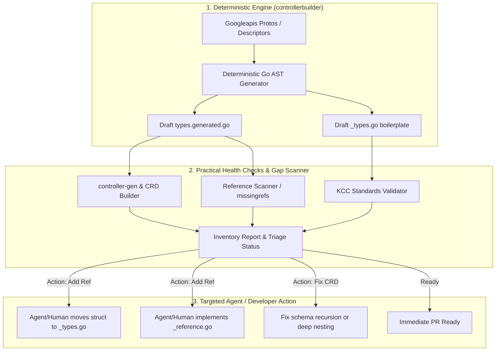
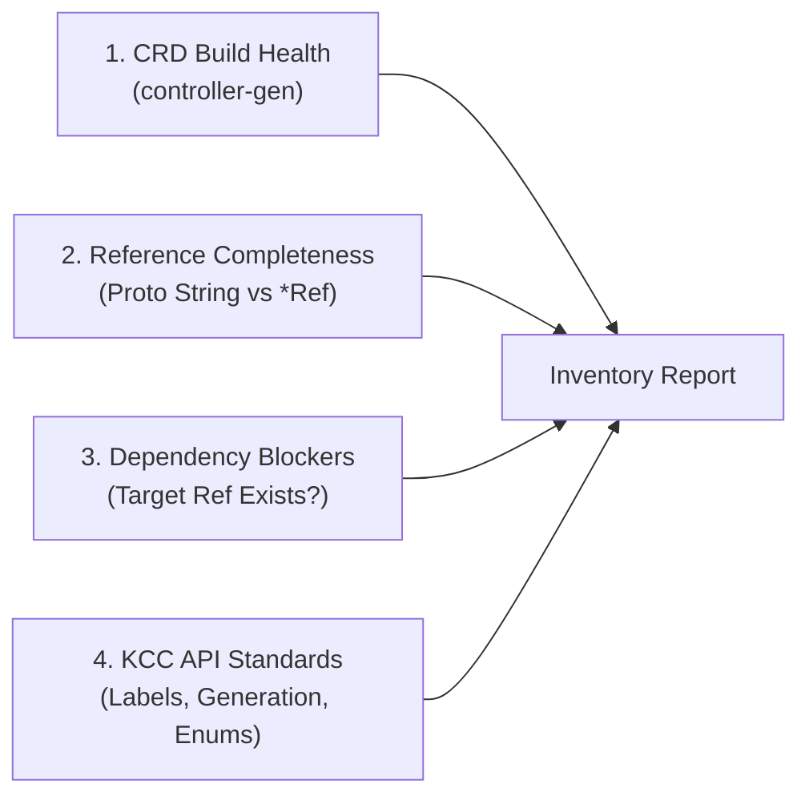
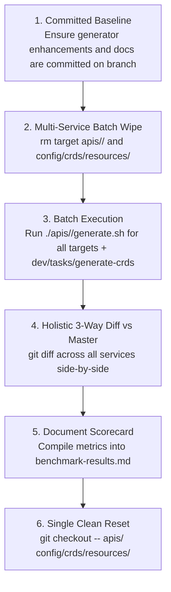

# Design Proposal: Bulk Deterministic CRD & Go Types Generation for KCC

**Author:** Senior SWE, Kubernetes Config Connector (KCC)  
**Status:** In Progress / Sandbox Experimentation  
**Branch:** `bulk-crd-gen-experiment`  
**Scope:** Phase 1 (CRD & Go Types Greenfield Bulk Generation)  

---

## 1. Executive Summary & Problem Statement

Kubernetes Config Connector (KCC) currently supports hundreds of GCP resources, but the surface area of Google Cloud APIs continues to expand rapidly. While our agentic greenfield pipeline can generate end-to-end direct controllers, the current workflow suffers from two primary bottlenecks:

1. **Review Fatigue on Mechanical Boilerplate:** Reviewing 1,000–3,000 lines of generated Go types per resource is slow and exhausting when 85–90% of the code consists of straightforward proto-to-Go mappings (primitive types, strings, integers, JSON tags, comments, and standard Spec/Status separation).
2. **AI Agent Hallucination & Token Inefficiency:** Prompting LLMs to generate entire `types.go` files from scratch introduces syntax errors, missing deepcopy annotations, and inconsistent conventions.

### Core Architecture: Deterministic-First with Native Go Overrides
**85–90% of KCC CRD definitions can be generated 100% deterministically from source-of-truth Protobuf schemas via `controllerbuilder generate-types`.**

Rather than inventing complex overlay DSLs, we strictly adhere to KCC's native Go file structure and greenfield skills:
- **`types.generated.go`**: 100% deterministic output generated directly from protobufs. Overwritten on every run.
- **`<kind>_types.go`**: Contains the root CRD structs (`Kind`, `KindSpec`, `KindStatus`) and **only the specific child structs that require manual/agent modifications** (such as swapping a raw string for a `*Ref`).
- **`<kind>_reference.go` / `<kind>_identity.go`**: Dedicated files for reference and identity implementations.
- **`controllerbuilder` Native Deduplication**: `controllerbuilder` automatically detects if a struct exists in `<kind>_types.go` and skips re-generating it in `types.generated.go`.

---

## 2. Practical Measurement: The 4 Concrete Health Checks

To objectively measure how much of a resource is correctly generated deterministically versus what requires human/AI attention, we run four practical checks:

### 2.1 Check 1: CRD Build & Syntactic Health (Pass / Fail)
- Runs `dev/tasks/generate-crds` (invoking `controller-gen`).
- Verifies that `types.generated.go` compiles, deepcopy functions are generated, and OpenAPI v3 schemas are emitted without recursion errors or panics.

### 2.2 Check 2: Reference Completeness
- Scans proto field definitions for GCP resource path strings (e.g., `google.api.resource_reference`, fields ending in `_name`, `_link`, `_kms_key`, `_network`, `_service_account`).
- Checks if the corresponding Go field is mapped to a structured `*Ref` (e.g., `kmsKeyRef`) or left as raw `*string`.

### 2.3 Check 3: Dependency Graph & Identity Blockers
- When a resource requires a reference to another GCP resource $X$:
  - Checks if $X$ already has an Identity (`<x>_identity.go`) and Reference (`<x>_reference.go`) in KCC.
  - If not, flags the blocker so the agent/developer can scaffold an external-only reference for $X$.

### 2.4 Check 4: KCC Standard Validation Rules
- **Enums**: Must be unvalidated `*string` (strictly **no** `+kubebuilder:validation:Enum` markers). KCC avoids enum validation markers to prevent breaking client-side validation when GCP APIs add new enum variants.
- **Labels**: Contains required labels (`cnrm.cloud.google.com/managed-by-kcc=true`, `cnrm.cloud.google.com/system=true`, `stability-level`).
- **ObservedGeneration**: `status.observedGeneration` is present and typed as `*int64`.
- **Output-Only Separation**: Fields with `google.api.field_behavior = OUTPUT_ONLY` or server-generated fields (`etag`) land in `Status` / `ObservedState`, not `Spec`.

---

## 3. Addressing Gaps in Generation

### 3.1 Tier 1: Deterministic Engine Improvements (`controllerbuilder`)
Before involving AI agents or human intervention, we maximize what `controllerbuilder` handles:
1. **Proto Annotations Parsing:** Ingest `google.api.resource_reference` and `google.api.field_behavior` directly from descriptor sets.
2. **Boilerplate Scaffolding:** Automatically generate initial `<kind>_types.go` with standard KCC labels, `observedGeneration`, and proto annotations (`// +kcc:spec:proto=...`).
3. **Reference Scaffolding:** If `google.api.resource` URL templates exist in the proto, automatically scaffold initial `<kind>_identity.go` and external-only `<kind>_reference.go`.

### 3.2 Tier 2: Targeted Agent Interventions (Following Greenfield Skills)
When a field is flagged as needing a reference or manual adjustment:
1. Agent moves **only that specific struct** from `types.generated.go` to `<kind>_types.go`.
2. Agent edits the field to use the appropriate `*Ref` type (e.g. `pubsubv1beta1.PubSubTopicRef`, `refsv1beta1.ProjectRef`, or custom external-only `<kind>Ref`).
3. Agent implements `<kind>_reference.go` and `<kind>_identity.go` if the target reference is new.
4. `controllerbuilder` automatically skips generating the moved struct on subsequent runs, keeping the generated file clean.

---

## 4. Practical Tracking & Work Queue Process

We maintain a straightforward, actionable inventory matrix generated by a lightweight CLI script or Go benchmark command:

### Sample Inventory Matrix

| Service | Kind | Proto Message | CRD Builds? | Missing Refs | Dependency Blockers | Status / Action |
| :--- | :--- | :--- | :---: | :--- | :--- | :--- |
| `alloydb` | `AlloyDBCluster` | `...alloydb.v1beta.Cluster` | ✅ Yes | None | None | **Ready** |
| `alloydb` | `AlloyDBInstance` | `...alloydb.v1beta.Instance` | ✅ Yes | `kmsKeyName` | KMSCryptoKey (exists) | **Action: Add Ref** |
| `bigquery` | `BigQueryDataset` | `...bigquery.v2.Dataset` | ✅ Yes | None | None | **Ready** |
| `ces` | `CESAgent` | `...ces.v1alpha.Agent` | ❌ No | `network` | ComputeNetwork | **Action: Fix OpenAPI Recursion** |
| `spanner` | `SpannerDatabase` | `...spanner.v1.Database` | ✅ Yes | `encryptionConfig.kmsKeyName` | None | **Action: Add Ref** |

### Work Queue Lifecycle:
1. **Batch Generation**: Run `generate-types` across target services.
2. **Automated Health Check**: Run `controller-gen` and reference gap scanner.
3. **Triage**:
   - **Green (Ready)**: 100% clean deterministic generation, ready for PR.
   - **Yellow (Action: Add Ref)**: Assigned to AI Agent to implement external-only ref and move struct to `<kind>_types.go`.
   - **Red (Action: Fix Schema)**: Assigned to human/agent for recursive schema or deeply nested struct fixes.

---

## 5. Ground-Truth Master Parity Evaluation Plan

To objectively evaluate deterministic generation fidelity without guesswork or artificial assumptions, we test against existing production Direct Controller services using a **single multi-service batch pass** directly on `bulk-crd-gen-experiment`:

### 5.1 Representative Evaluation Target Services

| Tier | Service (`apis/`) | Target Kinds | Complexity & Characteristics |
| :--- | :--- | :--- | :--- |
| **Standard Regional** | `bigqueryconnection` | `BigQueryConnectionConnection` | Standard regional resource, project hierarchy, simple references |
| **Complex Regional / Secrets** | `alloydb` | `AlloyDBCluster`, `AlloyDBInstance`, `AlloyDBBackup` | Deeply nested specs, cluster-instance hierarchy, `SecretRef` credentials |
| **Parent & Hierarchy Variety** | `kms` | `KMSKeyRing`, `KMSCryptoKey` | Hierarchical child resources, multi-signal resource references |
| **Multi-Resource & Build** | `cloudbuild` | `CloudBuildTrigger` | Deeply nested build configs, repo references, complex build steps |

### 5.2 The 6-Step Multi-Service Batch Execution Workflow

1. **Committed Experiment Baseline:** Verify that `controllerbuilder` code changes and docs are cleanly committed on `bulk-crd-gen-experiment`.
2. **Batch Clean Wipe:** Remove existing local types in `apis/<service>/<version>/` and CRD YAMLs in `config/crds/resources/` for all target evaluation services.
3. **Canonical Batch Generation:**
   - Execute `./apis/<service>/generate.sh` for each target service.
   - Run `dev/tasks/generate-crds` once to rebuild CRD YAML schemas.
4. **Holistic 3-Dimensional Diff Against Master:**
   - **Gate 1 (Build Verification):** Verify that all `generate.sh` scripts and `generate-crds` exit `0` and `go vet` passes.
   - **Gate 2 (CRD Schema Parity):** Run `git diff config/crds/resources/` to inspect the exact OpenAPI v3 schema delta across all services side-by-side.
   - **Gate 3 (Go Types Parity):** Run `git diff apis/` to measure deterministic field coverage, un-overridden boilerplate structs, and catalog all structs requiring manual override.
5. **Scorecard Documentation:** Compile exact, verified metrics into `docs/designs/benchmark-results.md`.
6. **Single Clean Restoration:** Restore modified APIs and CRD files via `git checkout -- apis/ config/crds/resources/`.
