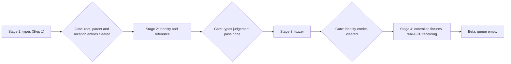

# Deterministic Generation for Identity, References, Fuzzers and Controllers

Status: draft proposal. This follows up the Step 1 design,
[deterministic CRD generation with a judgement queue](https://github.com/GoogleCloudPlatform/k8s-config-connector/pull/13394).
Tracking issue: [#13411](https://github.com/GoogleCloudPlatform/k8s-config-connector/issues/13411).

## 1. Overview

Step 1 made `generate-types` produce most of a new resource's API from its proto. It records everything it
couldn't decide in a per-service judgement queue. This proposal applies the same principle to the artifacts
that come after types in the greenfield pipeline: **emit what the proto states, and record what it doesn't.**

- **The approach fits, but not everywhere equally.** Identity and reference files, controllers with standard methods (archetype A)
  and fuzzers are highly mechanical. Fixtures fit only as skeletons. Compute-style and irregular APIs, and all brownfield work, stay
  in the judgement flow, which is the agent flow.
- **Delivery works like a ratchet.** A kind moves through types, then identity and reference, then fuzzer, then controller, one
  stage per PR, and only when a PR advances it. `generate.sh` never emits every stage at once (section 6).
- **Layout.** Generated code goes in `*.generated.go` files, which `generate.sh` regenerates and nobody edits by hand.
  An optional hand-written file can override any generated function, and it wins. Reviewers skip `*.generated.go`, and
  [.gitattributes](../../.gitattributes) already collapses those files on GitHub.
- **Judgement.** There is one queue per service, shared with Step 1. Open entries block both the next stage and promotion to
  beta.
- **Success is measured twice per phase.** First, delete, regenerate and compare on existing kinds, offline. Then run a pilot on new greenfield kinds.

## 2. Hypothesis

> If identity, reference, fuzzer, controller and fixture-skeleton code is generated from the proto and the Step 1
> types, and everything the generator can't decide goes into the judgement queue, then reviewers only have to read
> hand-written overrides and changes to the queue. Review comments about template-level problems drop to zero, and
> so do the bugs that keep slipping through review.

Predictions, tested by the gates in section 9:

1. At least 90% of canonical identity files regenerate with no override.
2. At least 60% of the archetype-A controllers whose tests can be replayed against MockGCP still pass with no hooks. At least 90% pass with no more than
   40 lines of hooks.
3. The median number of hand-written lines a reviewer reads per new kind drops from about 350 to at most 60. Today that's a 294-line
   controller plus a 56-line fuzzer.
4. Review comments about template-level problems drop to zero. Today those are 69 of the 78 comments reviewbot left on controller code.

## 3. Background: what Step 1 has landed

| Piece | PR | Status |
|---|---|---|
| Read `google.api.resource` | [#13397](https://github.com/GoogleCloudPlatform/k8s-config-connector/pull/13397) | merged |
| `+required` from `field_behavior`, behind a flag | [#13398](https://github.com/GoogleCloudPlatform/k8s-config-connector/pull/13398) | merged |
| `--prepopulate-spec`: Spec and ObservedState from the proto | [#13399](https://github.com/GoogleCloudPlatform/k8s-config-connector/pull/13399) | merged |
| The judgement queue, and suppressing `[refs]` findings while a kind is queued | [#13400](https://github.com/GoogleCloudPlatform/k8s-config-connector/pull/13400) | merged |
| Root, location and parent from the proto | [#13401](https://github.com/GoogleCloudPlatform/k8s-config-connector/pull/13401) | open |
| Acronym casing and message-valued maps | [#13402](https://github.com/GoogleCloudPlatform/k8s-config-connector/pull/13402) | open |
| Reference hints | [#13403](https://github.com/GoogleCloudPlatform/k8s-config-connector/pull/13403) | draft |
| Placing server-set fields | [#13404](https://github.com/GoogleCloudPlatform/k8s-config-connector/pull/13404) | draft |
| Design doc and runbook | [#13394](https://github.com/GoogleCloudPlatform/k8s-config-connector/pull/13394) | draft |

The Step 1 runbook lists four gaps, and this proposal closes all of them:

1. Nothing lists which kinds are ready for identity and refs.
2. Identity and refs can't be generated without also scaffolding a controller.
3. There's no aggregate view of the queue.
4. Nothing forces the queue to drain.

## 4. Does the approach fit?

| Artifact | Evidence that it's mechanical | Verdict | Where it breaks down |
|---|---|---|---|
| Identity | There are 317 canonical files using `gcpurls` and `IdentityV2`. The median is 113 lines, and half fall between 108 and 121. 69% contain only the standard functions. The [skill](../../.gemini/skills/kcc-identity-reference/SKILL.md) is a mechanical recipe. | **Strong fit** | Kinds with more than one name pattern (about 9%), unusual roots, patterns missing from Cloud Asset Inventory, legacy status fields |
| Reference | 280 files use `refs.Ref`. They are pure boilerplate: the Ref struct, the GVK, `refs.Normalize` and registration. | **Strong fit** | Nothing for greenfield; the legacy fallbacks are brownfield-only |
| Controller, archetype A | Archetype A (all four standard methods) is 45% of mapped kinds. Controllers have a median of 294 lines, and half fall between 267 and 334. 88% of reviewbot comments were about template-level problems. Export was broken or stubbed in 5 of 10 audited merged controllers. | **Strong fit** | What to do with unset fields, server-side defaults, clients that don't follow the standard shape |
| Controller, archetypes B, C and D | B has no Update, C has a server-generated ID and D is a singleton. B and C are about 10% of mapped kinds each and D is 3%. Each is a small variant of A. | **Good fit, staged** | D's Find, Create and Delete semantics need sign-off |
| Controller, compute-style and irregular | Compute-style is 14% of mapped kinds and uses a separate client stack. About 18% are irregular. | **Poor fit**: queue entry only, agent flow | Everything |
| Fuzzer | There are 348, with a median of 56 lines, and 306 were written by an LLM. They can be derived from `+kcc:proto:field`. | **Strong fit** | FilterSpec tweaks specific to one resource |
| Fixtures | The proto doesn't contain the values, and recording against real GCP stays manual. | **Skeleton only** | The values themselves, and the dependencies |
| Brownfield and existing controllers | These must behave exactly like the Terraform or DCL controller. | **Out of scope** | n/a |

> [!NOTE]
> For identity, the payoff on the current backlog is small. 62 of the 66 greenfield kinds that have no controller already have an
> identity file: 45 canonical and 17 in the old pattern. Its value is as the contract every controller binds to, and for the roughly 550
> resources Step 1 targets, most of which will be new.

## 5. Goals and non-goals

Goals:

- Given the same proto, types and flags, the generators always produce the same identity, reference, fuzzer and controller code.
- Reviewers read only hand-written code and changes to the queue.
- Every guess and every omission is recorded in the judgement queue.
- Existing resources change only if their service opts in. A kind advances a stage only when a PR advances it.

Non-goals:

- Migrating brownfield kinds from Terraform or DCL to direct, or changing existing direct controllers. Existing controllers are
  used only as the regeneration test set.
- Fixture values, and recording against real GCP. Only skeleton fixtures are generated.
- MockGCP.
- Deciding what an update should do with fields the user left unset (section 12).

## 6. Delivery model: a staged pipeline that works like a ratchet

Each kind goes through four stages, in order, and each stage is its own PR:

### 6.1 Options considered

| Option | How a kind advances | Assessment |
|---|---|---|
| A. All at once | A service opts in, and `generate.sh` emits every stage for every kind. | **Rejected.** Each kind becomes one PR of about 2,200 lines that mixes judgement from four stages. The types can't merge until the controller has been recorded against real GCP. A wrong guess upstream, such as a missed reference, gets baked into identity, fuzzer and controller in the same PR. |
| B. Ratchet by file presence | An agent runs a stage's command once. From then on, `generate.sh` regenerates only `.generated.go` files that already exist. | **Viable.** PRs are small and there's nothing to configure. But the state is implicit: deleting a file silently drops the kind out of regeneration, and a "ready for the next stage" list needs a scan of the tree. |
| C. Ratchet by stage lists in `generate.sh` | Each stage's command in `generate.sh` lists its kinds with `--resource`. To advance a kind, a PR adds one line to the next stage's command, together with that stage's generated output. | **Recommended.** It's explicit, reviewable and easy to grep. `make generate` reproduces exactly the current state, so `validate-generated-files` catches drift. A check enforces the order and the gates (6.3). |

### 6.2 PR sizes

These are medians of lines added in 85 merged greenfield PRs: 39 types PRs, 8 identity PRs and 38 controller PRs. The totals add up the medians of each part, so they are rough.

| Stage | What it contains (median lines added) | Lines today | Generated, so reviewers skip it | What reviewers read after this proposal |
|---|---|---|---|---|
| 1. Types | `_types.go` 137, CRD 250, deepcopy 248, `types.generated.go` 64, `mapper.generated.go` 78, the queue | about 790 | about 640 | Judgement edits to `_types.go`, and the change to the queue |
| 2. Identity and reference | identity 113, reference 85, identity test 74, deepcopy about 15 | about 290 (PRs with only identity: median 187) | all of it | Overrides, only where an evidence test fails |
| 3. Fuzzer | fuzzer 50 | about 50 | all of it | FilterSpec hooks, rarely |
| 4. Controller | controller 274, fixture inputs 78, recorded goldens about 680 | about 1,030 | the controller, 274 | Hooks (at most 40 lines), fixture values (about 78), and a quick look at the recorded goldens |
| All at once | everything above | about 2,160 | about 1,250 | The same judgement, mixed across four stages |

Today, identity files ship inside types PRs (all 39 of them), and so do reference files (32 of 39). Fuzzers ship inside controller PRs (29 of 38).

- **PRs for stages with nothing to review can be batched.** Stages 2 and 3, and the generation half of stage 1, leave almost
  nothing to review, so one PR can advance many kinds, for example identity for every kind in a service. CI shows that
  the output is exactly what the generator emits.
- **PRs that need judgement stay one kind at a time.** That's the types judgement pass, and stage 4: hooks, fixture values and recording.
- **Stage 3 on its own is small.** If a fuzzer PR per kind is too small, batch several, or fold stage 3 into stage 2's PR once the
  types judgement pass is done. The ratchet only fixes the order of stages, not where one PR ends and the next begins.
- `.gitattributes` already collapses CRDs and `*.generated.go` files on GitHub. Adding `zz_generated.deepcopy.go` would
  collapse the rest of stage 1's generated output.

### 6.3 Stage gates

A kind can enter a stage only when none of its open queue entries have a reason that stage depends on:

| To enter | Must have no open entries with these reasons | Why |
|---|---|---|
| Stage 2, identity and reference | `root-ref-guessed`, `root-ref-not-modelled`, `location-or-parent-ref`, `location-parent-unknown`, `parent-ref-guessed`, `parent-ref-not-modelled` | Identity is built from the Spec's root, parent and location fields |
| Stage 3, fuzzer | the resource-level `untriaged-bulk-generation`, every `possible-reference*` reason, `unsupported-field-type`, `output-only-in-comment-only`, `server-set-field-placed`, `empty-observedstate` | The fuzzer's field lists and the mapper have to be final |
| Stage 4, controller | every `identity-*` reason | The controller binds to the identity |
| Beta | any reason at all | Decision Q7 |

Identity can start before the types judgement pass is done, because it only depends on the root, parent and location fields. Step 1 always
emits `untriaged-bulk-generation`, so the stage 3 gate is what requires that pass to be finished.

A check in `tests/apichecks` enforces two rules. It extends
[generator_script_test.go](../../tests/apichecks/generator_script_test.go).

- A kind listed for a stage must also be listed for every earlier stage.
- A kind can't be listed for a stage while it has an open entry that blocks that stage.

This closes Step 1's fourth gap: a kind can't advance while its blocking entries are open.

## 7. Decisions so far

| # | Decision |
|---|---|
| Q1 Scope | Greenfield only. Existing controllers serve only as the regeneration test set. |
| Q2 Controller layout | `<kind>_controller.generated.go` is regenerated and never edited. An optional hand-written `<kind>_controller.go` wins, the same rule generate-mapper uses. |
| Q3 Unset fields | **Deferred.** The diff logic lives in one generated `compare<Kind>()` function, marked `// TODO(controller-gen): unset-field semantics pending maintainer decision`. For now it behaves like today's greenfield pipeline. |
| Q4 Archetypes | Every archetype is needed. They **ship in staggered PR phases, starting with archetype A.** |
| Q5 Order | The identity and reference generator comes first, then controllers. |
| Q6 Identity layout | The same split as Q2: `<kind>_identity.generated.go` and `<kind>_reference.generated.go`. **Tests check that they behave in the standard way.** A failing test means the kind needs custom logic, as well as a queue entry. |
| Q7 Queue | Reuse Step 1's queue file and line format, with new reasons. Every guess marker needs a matching entry. Open entries block promotion to beta, but not the alpha merge. |
| Q8 Fuzzer and fixtures | Generate fuzzers deterministically, **plus skeleton fixtures** whose placeholder values each get a queue entry. |
| Q9 Success | Two gates per phase: an offline regeneration test with thresholds, then a pilot that measures how many hand-written lines reviewers read and counts template-level comments. |
| Q10 Adoption | Generators come first for the archetypes they support, with an opt-in flag per service and updated agent and reviewer skills. Unsupported archetypes keep the current flow. |
| Delivery | A staged ratchet (section 6): types, then identity and reference, then fuzzer, then controller, one stage per PR, each advanced explicitly. |
| Delete not found | Return `(true, nil)`, the controller convention. This has a known shortcoming, flagged in 8.4. |

## 8. Proposed design

Command and flag names below are proposals. With the flags off, output is byte-identical to today's, as in Step 1.

### 8.1 Shared: an API model built from service descriptors

- Extend [resource.go](../../dev/tools/controllerbuilder/pkg/protoapi/resource.go) to read the following. The data is already in the
  `protoregistry.Files` that [loader.go](../../dev/tools/controllerbuilder/pkg/protoapi/loader.go) builds, but nothing reads it yet.
  - `google.api.default_host`
  - the standard methods: their AIP names, HTTP bindings and the `parent`, `<resource>_id`, `update_mask` and `etag`
    request fields
  - the long-running operation (LRO) response and metadata types, from `google.longrunning.operation_info`
- Classify every resource into archetypes A to I. The classifier is golden-tested against all 418 kinds mapped in `apis/*/generate.sh`.
- Resolve the Go client by following the proto's `go_package` to the GAPIC package and its REST constructor, using `go/packages`. If that fails,
  file `client-not-found`.

### 8.2 Stage 2: the identity and reference generator (phase 0)

- **Command.** `generate-identity` only scaffolds identity and reference files, which closes gap 2 (section 3). `generate.sh` calls it for the kinds
  listed in the identity stage.
- **`<kind>_identity.generated.go`** follows the canonical recipe
  ([skill](../../.gemini/skills/kcc-identity-reference/SKILL.md),
  [example](../../apis/artifactregistry/v1beta1/artifactregistryrepository_identity.go)):
  - a `gcpurls.Template` built from `default_host` and the first name pattern
  - a struct whose fields come from the pattern's variables, in CamelCase
  - `String`, `FromExternal`, `Host` and `ParentString`
  - `getIdentityFrom<Kind>Spec`, derived from the Step 1 Spec layout (root reference, location, parent reference and resource ID)
  - `GetIdentity`, including the cross-check against `status.externalRef`
  - the `ServerGeneratedIdentity` variant for archetype C (server-generated IDs)
- **Nested resources.** The generator supports both Spec layouts: a parent reference on its own, or project and location next to
  a parent reference. Until [#13401](https://github.com/GoogleCloudPlatform/k8s-config-connector/pull/13401) lands, kinds
  whose root isn't a project, and nested kinds, get an `identity-root-unknown` entry.
- **`<kind>_reference.generated.go`** contains:
  - the `Ref` struct with `External`, `Name` and `Namespace`, and the canonical doc comments
  - a call to `refs.Register`
  - the boilerplate methods
  - `Normalize`, which delegates to `refs.Normalize` (never `NormalizeWithFallback`)
- **Hand-written wins, function by function.** This reuses the approach in
  [mappergenerator.go](../../dev/tools/controllerbuilder/pkg/codegen/mappergenerator.go), which skips any function
  that already exists in a non-generated file. Extra methods such as `ID()` or `IsGlobal()` go in the hand-written file.
- **Tests.**
  1. *Conformance.* A shared helper, called from a generated `<kind>_identity_generated_test.go`, checks that parsing and formatting
     round-trip, that the `//host/` prefix is handled, and that other formats are rejected.
  2. *Evidence.* These tests show when a kind needs custom logic:
     - The template matches Cloud Asset Inventory: `TestRegisteredTemplatesMatchCAI` in
       [registry_test.go](../../pkg/gcpurls/registry_test.go).
     - The identity matches the `_identities.yaml` goldens: `TestGoldenIdentitiesYamlFiles` in
       [cmd_test.go](../../pkg/cli/powertools/cais/cmd_test.go).
     - New check: `GetIdentity` on each fixture's `create.yaml` gives the same value as `status.externalRef` in its
       `_generated_object_<kind>.golden.yaml`.
  3. If an evidence test fails, the kind needs a hand-written override and an `identity-evidence-mismatch` entry.
- **Queue reasons:** `identity-multi-pattern`, `identity-root-unknown`, `identity-not-in-cai`, `identity-evidence-mismatch`.

### 8.3 Stage 3: the fuzzer generator (phase 1)

- `generate-fuzzer --deterministic` writes `<kind>_fuzzer.generated.go` from the `+kcc:proto:field` annotations:
  - `SpecField` or `StatusField`, depending on where each field landed
  - `Unimplemented_Identity(".name")`
  - `Unimplemented_NotYetTriaged` for unmapped fields, which Step 1 has already queued
- FilterSpec and FilterStatus are hand-written hooks. Services that haven't opted in keep the LLM mode.

### 8.4 Stage 4: the controller generator, archetype A (phase 2)

A new `generate-controller --generated` mode writes `pkg/controller/direct/<service>/<kind>_controller.generated.go`
and registers the model. Without the flag, the command behaves as it does today.

| Method | What the generated code does |
|---|---|
| AdapterForObject | Gets the identity, normalizes references, converts the Spec to proto and sets the name. If the resource has labels (178 of the 418 mapped kinds do), copies the metadata labels. Builds the GAPIC REST client. |
| Find | Calls `Get(name)`. Not found returns false. |
| Create | Calls `Create(parent, <kind>_id, resource)`, waits for the LRO if there is one, then calls `Get` and `updateStatus`. |
| Update | Strips everything but Spec fields from the live resource and calls `compare<Kind>()`. If there's no diff, it just calls `updateStatus`, so status is updated on every path. Otherwise it reports the diff, copies the etag if there is one, calls `Update(resource, mask)`, waits for the LRO, then calls `Get` and `updateStatus`. |
| Delete | Calls `Delete(name)`, passing the etag if the request has one. Not found returns `(true, nil)`, the controller convention that avoids a reconciliation loop. Otherwise it waits for the LRO and returns `(true, nil)`. |
| Export | Converts the live resource back to a Spec, then sets the GVK, name and parent references from the identity. This fixes a name and GVK bug that reviewers flagged on 4 PRs but that merged anyway. |
| AdapterForURL | Parses the URL with the identity's `FromExternal`, then builds the adapter. This replaces the 269 existing stubs that return `nil, nil`. |
| updateStatus | Sets the ObservedState from the proto and sets `externalRef`, then calls `op.UpdateStatus`. |

- **`compare<Kind>()`** carries the Q3 TODO. By default it compares only Spec fields, calls
  [DiffForTopLevelFields](../../pkg/controller/direct/common/compare.go#L198), then calls the `populateDefaults` hook.
  Fields marked `IMMUTABLE` are left out of the update mask, and changing one is an error. The proto provides all of
  this, so no hook is needed.
- **Hooks** are generated as functions that do nothing: `normalizeDesired`, `populateDefaults`, `validateUpdate`,
  `mutateCreateRequest` and `mutateUpdateRequest`. A hand-written definition wins, and the same rule lets the hand-written file
  replace a whole method.
- **Queue reasons:**
  - `archetype-unsupported`: no controller is written
  - `client-not-found`
  - `lro-response-mismatch`
  - `immutable-in-comment-only`: per field
  - `server-default-candidate`: per field

> [!WARNING]
> **Known shortcoming: what Delete returns.** Controllers return `(true, nil)` when the resource is already gone, to avoid a
> reconciliation loop, and generated code will do the same. But the `Adapter` interface in
> [interfaces.go](../../pkg/controller/direct/directbase/interfaces.go) says to return `(false, nil)` in that case, and the
> caller discards the value anyway
> ([directbase_controller.go#L409](../../pkg/controller/direct/directbase/directbase_controller.go#L409)). Eventually the documented contract and the caller
> should agree. This proposal flags the problem but doesn't fix it.

### 8.5 Stage 4: skeleton fixtures (phase 2)

- `generate-fixture` runs once per kind. An agent runs it; `generate.sh` never does, and it never overwrites existing files. It writes these files into
  `testdata/basic/<service>/<version>/<kind>/<kind>-minimal/`:
  - `create.yaml` contains:
    - the `+required` fields
    - the identity fields, filled with `${projectId}` and `${uniqueId}`
    - a placeholder for each other value, chosen by type, such as the first enum value that isn't UNSPECIFIED. Each placeholder is marked `# +kcc:guess` and gets a `fixture-placeholder` entry.
  - `update.yaml` changes one updatable field that isn't `IMMUTABLE`. That choice is a guess, so it gets a queue entry.
  - `dependencies.yaml` contains the parents the Spec refers to, copied from the parent's existing fixture if it has one. Otherwise it contains a placeholder with a queue entry.
- It also makes sure the kind isn't on the re-reconcile exclusion list in [ratcheting.go](../../tests/e2e/ratcheting.go).
- `fixture-placeholder` entries must be cleared before merge. This is the one exception to Q7. `TestAllInSeries` runs every
  fixture directory, and the PR has to include recordings from real GCP anyway.

### 8.6 Extensions to the judgement queue

- **Same file and format, with a new token that names the artifact** an entry applies to, for example
  `kind=X group=Y: controller field ".spec.foo" reason=server-default-candidate (...)`. Step 1's `resource` and `field`
  tokens stay valid. `TestJudgementQueueIsWellFormed` is extended to accept the new ones.
- **Every guess marker has an entry.** Each per-kind `+kcc:guess` or `TODO(controller-gen)` marker in generated code must have a matching entry. The Q3 TODO is
  in the template itself, not per kind, so it's tracked in section 12 instead.
- **Entries have two jobs.** They gate the next stage (6.3) and promotion to beta (Q7).
- **Aggregate report.** A new `dev/tasks/judgement-queue-report` shows counts by reason, service, kind and stage, including which kinds are
  ready for their next stage. It closes gaps 1 and 3 (section 3).

### 8.7 CI and checks

- `generate.sh` runs each stage's command for the kinds listed in that stage. `make generate` and
  [validate-generated-files](../../dev/ci/presubmits/validate-generated-files) then catch drift without any new tooling. The
  exception is the 15 services on the skip-list in
  [generate-types-and-mappers](../../dev/tasks/generate-types-and-mappers), which CI never regenerates.
- The ratchet check (6.3) and the generator-script rule go in
  [generator_script_test.go](../../tests/apichecks/generator_script_test.go). The rule: if a kind has a
  generated file, `generate.sh` must call the matching generator for that kind.
- [identity_test.go](../../tests/apichecks/identity_test.go): the casing test also covers
  `_identity.generated.go`. [naming_test.go](../../tests/apichecks/naming_test.go) already ignores
  `.generated.go` files, so it needs no change.
- A new presubmit: when anything under `dev/tools/controllerbuilder/template/` changes, rerun the MockGCP tests for every kind that has opted in.

### 8.8 Pipeline adoption

- **Skills.** Updating the reviewer skill also resolves blocker B5.
  - [kcc-identity-reference](../../.gemini/skills/kcc-identity-reference/SKILL.md): advance the kind to stage 2, and write
    overrides only where an evidence test fails.
  - [kcc-direct-controller-logic-greenfield-implementer](../../.gemini/skills/kcc-direct-controller-logic-greenfield-implementer/SKILL.md):
    advance the kind to stage 4, then work through its queue entries: hooks, fixture values and `record-gcp`.
  - [reviewgen-greenfield-controller](../../.gemini/skills/reviewgen-greenfield-controller/SKILL.md): skip
    `*.generated.go`, review the hand-written files and the queue changes, and stop requiring `CompareProtoMessage`.
- **Overseer stages** ([guide](../ai/overseer-developer-guide.md)) map one-to-one onto pipeline stages for the archetypes the generators support. Other
  archetypes stay on the current flow.
- **Existing kinds** don't change.

## 9. Implementation phases and gates

Phases build the generators. Stages are what each kind goes through. Phase 0 builds stage 2, phase 1 builds stage 3,
phase 2 builds stage 4 for archetype A, and later phases extend stage 4 to other archetypes.

> [!IMPORTANT]
> Every archetype is needed, but they **ship as staggered PR phases of experimentation, starting with archetype A**. A
> phase must pass its offline and pilot gates before the next phase starts.

**Phase 0: stage 2, identity and reference**

| PR | Contents |
|---|---|
| 0.1 | API model from service descriptors, the archetype classifier, and its golden test over all 418 kinds |
| 0.2 | `generate-identity`, its templates, the hand-written-wins rule, and the identity stage list in `generate.sh` |
| 0.3 | The shared conformance helper and the generated per-kind tests |
| 0.4 | The fixture evidence check, the identity queue reasons, and the extended queue-format test |
| 0.5 | The ratchet check (order and gates), the aggregate queue report, and the beta rule written into [qualify-alpha-for-beta.md](../ai/qualify-alpha-for-beta.md) |
| 0.6 | Harness and report for the offline gate |
| 0.7 | Skill updates, then the pilot. The 17 old-pattern backlog identities are regenerated as those kinds come up. |

**Phase 1: stage 3, fuzzer**

| PR | Contents |
|---|---|
| 1.1 | Deterministic fuzzer mode, and the fuzzer stage list |
| 1.2 | Offline check against the 306 existing LLM-written fuzzers, then the pilot |

**Phase 2: stage 4, archetype-A controllers**

| PR | Contents |
|---|---|
| 2.1 | The controller template in `--generated` mode: the methods, hooks, `compare<Kind>()`, Export and AdapterForURL, labels, LRO handling and client resolution |
| 2.2 | Controller queue reasons, and the check that every guess marker has an entry |
| 2.3 | `generate-fixture`, and the rule that placeholders must be cleared before merge |
| 2.4 | CI: the generator-script rule for controllers, and the presubmit that reruns MockGCP tests when the template changes |
| 2.5 | Harness for the offline gate over 79 archetype-A kinds, measuring both Q3 variants |
| 2.6 | Skill and reviewbot updates, then a pilot on the next 10 greenfield archetype-A kinds |

**Phases 3 to 6** extend stage 4, and each passes the same two gates using existing kinds of that archetype as its test set.

| Phase | Archetype | What it adds |
|---|---|---|
| 3 | B: no Update | Update still compares, and returns an immutable-resource error when there's a diff |
| 4 | C: server-generated ID | `ServerGeneratedIdentity`. Create reads the ID from the response, and Find uses `status.externalRef`. |
| 5 | D: singleton | Find is Get, Create is Update, and Delete abandons the resource. The semantics need sign-off; a reviewer flagged them on #12903. |
| 6 | F, G, E and compute-style | Generate a variant where it's cheap. Otherwise file `archetype-unsupported` and use the agent flow. |

**Every PR**
- Unit tests, table-driven, with golden files for each template's output.
- With the flags off, output is byte-identical to a generator built from master, as in Step 1.
- `make fmt`, `go vet ./...`, `validate-generated-files` and `go test ./tests/apichecks/...` all pass.

**Gates.** The thresholds are proposals.

| Phase | Offline test on existing kinds | Pilot on new greenfield kinds |
|---|---|---|
| 0 | At least 90% of the 317 identity files regenerate as equivalent code with no override. Equivalent means the same template and fields, and the same results on the evidence tests. The 280 reference files are compared by structure; `Normalize` is compared only for the 62 that already use plain `refs.Normalize`. Every mismatch has a queue entry or a failing evidence test. | No review comments on generated identity or reference files, and the evidence tests pass |
| 1 | At least 90% of fields are classified the same way as in the 306 existing fuzzers, and the generated fuzzers pass | No review comments on fuzzers |
| 2 | Of the 79 kinds whose tests replay against MockGCP, at least 60% pass their existing tests with no hooks. Those tests are MockGCP replay, the re-reconcile check and `_exported.yaml`. At least 90% pass with no more than 40 lines of hooks. Every failure maps to a queue reason. | Over 10 kinds, the median number of hand-written lines reviewers read is at most 60, down from about 350, with no review comments about template-level problems |
| 3–6 | Same shape, using that archetype's existing kinds | Same |

## 10. Gaps, pitfalls and blockers

### 10.1 Blockers, fixed within phases 0 to 2

| # | Blocker | Fixed in |
|---|---|---|
| B1 | Parts of Step 1 are still open. `--prepopulate-spec` and the queue have merged (#13399, #13400), so phase 0 can start for kinds rooted at a project or a project and location. Nested kinds and other roots need #13401. The stage 3 gate is weaker until reference hints (#13403) land, because fewer reference candidates get queued. | Dependency, tracked in #13411 |
| B2 | The generator reads no service or method descriptors. | PR 0.1 |
| B3 | The templates are out of date. [controller.go](../../dev/tools/controllerbuilder/template/controller/controller.go) doesn't compile as emitted, uses `CompareProtoMessage`, and uses the legacy identity. [identity.go](../../dev/tools/controllerbuilder/template/apis/identity.go) and [refs.go](../../dev/tools/controllerbuilder/template/apis/refs.go) emit `strings.Split` and `ExternalNormalizer`. | New templates in PRs 0.2 and 2.1. The old templates stay, so default output doesn't change. |
| B4 | Identity and refs can only be produced through `generate-controller` (gap 2). | PR 0.2 |
| B5 | The skills contradict each other: the reviewer skill requires `CompareProtoMessage`, and the implementer skill forbids it. | PR 2.6 |

### 10.2 Pitfalls

| # | Pitfall | Mitigation |
|---|---|---|
| P1 | No decision yet on what an update does with unset fields (Q3). | The logic is isolated in `compare<Kind>()`. PR 2.5 measures how many hooks each option needs. |
| P2 | Resolving the Go client. GAPIC package and constructor names vary, and some services have no REST transport. 30 controllers use discovery clients, and 5 use protos generated for MockGCP. | Resolve deterministically with `go/packages`. If that fails, file `client-not-found`. |
| P3 | Delete's documented contract, the controller convention and the caller disagree (see 8.4). | Generated code follows the convention. The mismatch is flagged here and not fixed. |
| P4 | Blast radius: a bug in the template affects every opted-in kind at once. | When the template changes, CI reruns the MockGCP tests for opted-in kinds. |
| P5 | CI never regenerates the 15 services on the skip-list. | A service that opts in either leaves the skip-list or gets a targeted check. |
| P6 | Some services pin their own proto version with `PROTO_SHA`. | The new commands use the same descriptor set as `generate-types`. |
| P7 | Hooks grow until reviewers are reading as much code as before. | Hand-written lines are the headline metric in both gates. |
| P8 | Skeleton fixtures clash with the test harness, which runs every fixture directory. | Fixtures are generated once, and their placeholders are cleared before merge (8.5). |
| P9 | MockGCP doesn't behave exactly like real GCP. | The offline gate is necessary but not sufficient. Pilot kinds record against real GCP. |
| P10 | Old-pattern identities: 50 of the 155 archetype-A kinds that have controllers, and 17 of the 62 backlog identity files. | The 50 are left out of the test set, leaving 105. The 17 backlog kinds have no controller yet, so they're regenerated when their turn comes. |
| P11 | Recording against real GCP is still the slowest step. | Generation shortens review, not recording or quota waits. |
| P12 | The beta rule needs maintainers to sign off. | Documented in PR 0.5. |
| P13 | Stage lists in `generate.sh` get long. | One command per stage. The aggregate report shows which stage each kind is at. |

## 11. Risks

| Risk | Mitigation |
|---|---|
| Maintainers don't accept `.generated.go` controllers | Generated mappers set the precedent. The phase 2 numbers come before any adoption. |
| The template is subtly wrong for a whole class of API | Queue reasons and the offline test catch it. Fixes for one kind go in hooks, not forks of the template. |
| Kinds stall at a gate because nobody works the queue | The aggregate report makes stuck kinds visible, and stage PRs that need no review can be batched. |
| The rest of Step 1 slips | Phase 0 doesn't need #13401 for kinds rooted at a project or a project and location. |

## 12. Open items for maintainers

- **What an update does with unset fields (Q3).** PR 2.5 provides the data: how many hooks each option needs.
- **Blocking beta on open entries** needs sign-off (P12).
- **Delete's return value when the resource is gone** (8.4). Flagged; not fixed here.
- **Fixture checks** are an optional follow-up. They could check that `update.yaml` produces an update call, that goldens contain no 4xx
  or SERVICE_DISABLED responses, that no project IDs are hardcoded, that an audit probe is present, and that the PR only touches the kind it's for.
- **The 15 services on the skip-list** (P5).
- **Where stage PRs split.** Should stage 3 fold into stage 2's PR when the types judgement pass is already done (6.2)?

## Appendix: evidence

| Fact | Value |
|---|---|
| Kinds mapped in `apis/*/generate.sh` (418), by archetype | A 45.2%, B 10.0%, C 10.3%, D 3.1%, compute-style 13.6%, other 17.8% |
| Greenfield backlog: types but no controller of any kind | 66 kinds: A 23, B 13, C 11, D 2, other 17 |
| Archetype-A test set | 155 kinds with a direct controller. 105 of them have a canonical identity. 84 of those have an `_http.log`, and 79 are in services that have a MockGCP. 5 have VCR recordings. |
| Review of 36 controller PRs | 42 substantive human comments. reviewbot left 78, and 69 of them were about template-level problems. |
| Bugs that recur | The Export name and GVK bug was flagged on 4 PRs and merged twice. "Update status on every path" was broken after merge (#13305). |

Sources:
- the archetype survey: the 418 mapped kinds, classified against the googleapis descriptors that `apis/git.versions` pins
- counts of the direct controllers, identity, reference and fuzzer files in the tree
- 96 merged greenfield PRs and their review comments, fetched with `gh`
