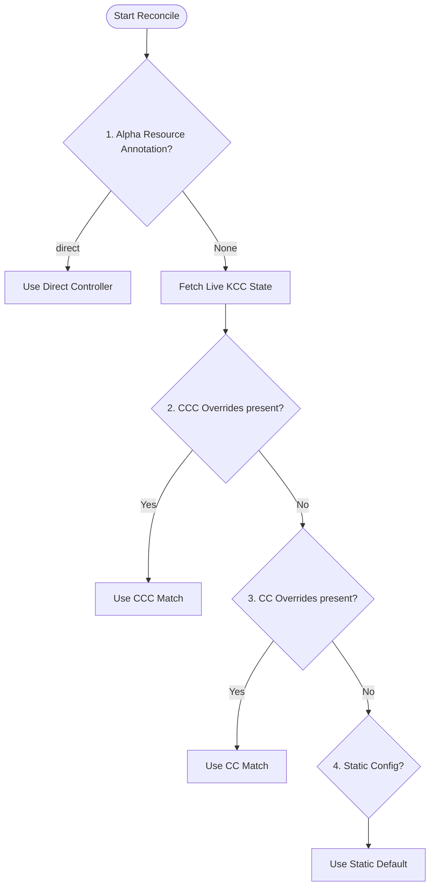

# Design Doc: Global Controller Overrides via ConfigConnector

## Context & Problem Statement
Config Connector (KCC) dynamically routes resource reconciliation to one of its underlying engines: **Terraform (TF)**, **DCL**, or **Direct** controllers. 

In **Namespaced Mode**, KCC supports namespaced overrides via `ConfigConnectorContext` (CCC):
```yaml
spec:
  experiments:
    controllerOverrides:
      BigQueryDataset.bigquery.cnrm.cloud.google.com: direct
```
This allows the platform team to opt-in or opt-out of new reconcilers (e.g., during migration to Direct) for specific namespaces.

However, in **Cluster Mode**, `ConfigConnectorContext` resources do not exist. The platform team uses a single cluster-scoped `ConfigConnector` (CC) resource to configure KCC. Previously, there was no way to specify global controller overrides, forcing Cluster Mode installations to strictly rely on KCC's static defaults.

This design document proposes introducing a global `controllerOverrides` field in the `ConfigConnector` (CC) CRD to provide feature parity and support global controller overrides in Cluster Mode.

---

## Proposed Solution

We introduce `spec.experiments.controllerOverrides` to the cluster-scoped `ConfigConnector` CRD:

```yaml
apiVersion: core.cnrm.cloud.google.com/v1beta1
kind: ConfigConnector
metadata:
  name: configconnector.core.cnrm.cloud.google.com
spec:
  mode: cluster
  experiments:
    controllerOverrides:
      IAMPartialPolicy.iam.cnrm.cloud.google.com: direct
```

### Schema Definition
The `CCExperiments` struct in `operator/pkg/apis/core/v1beta1/configconnector_types.go` is updated as follows:

```go
type CCExperiments struct {
	// MultiClusterLease defines configuration specific to multi-cluster leader election.
	MultiClusterLease *MultiClusterLeaseSpec `json:"multiClusterLease,omitempty"`

	// ResourceSettings allows specifying which resources to enable or disable.
	ResourceSettings *ResourceSettings `json:"resourceSettings,omitempty"`

	// ControllerOverrides allows specifying which controller to use for a given
	// resource kind globally, overriding the system default.
	// The format for the entries should follow Kind.group, e.g. SQLInstance.sql.cnrm.cloud.google.com: direct
	// +optional
	ControllerOverrides map[string]k8scontrollertype.ReconcilerType `json:"controllerOverrides,omitempty"`
}
```

---

## Controller Routing & Precedence (Resolution Ordering)

The parent controller (`pkg/controller/parent/controller.go`) determines the target controller type using a strictly defined order of precedence. 

We integrate the new `ConfigConnector` (CC) global overrides directly below the namespaced `ConfigConnectorContext` (CCC) overrides:



### Order of Precedence:

1.  **Resource Annotation (Alpha/Deprecated):**
    *   If the resource has the annotation `alpha.cnrm.cloud.google.com/reconciler: direct`, KCC immediately routes it to the Direct controller.
    *   *Rationale:* Individual resource annotation overrides have the highest precedence for backwards compatibility.

2.  **Namespaced CCC Overrides (`ConfigConnectorContext`):**
    *   If a `ConfigConnectorContext` (CCC) exists in the resource's namespace and specifies a controller override for the GroupKind, KCC routes to that reconciler.
    *   *Rationale:* Namespaced settings are closest to the target resource and take precedence over global cluster-scoped settings.

3.  **Global CC Overrides (`ConfigConnector`):**
    *   If a global `ConfigConnector` (CC) resource is present and specifies a controller override for the GroupKind, KCC routes to that reconciler.
    *   *Rationale:* Global settings apply to all namespaces in Cluster Mode, and act as a fallback default for Namespaced Mode if no ccc-level override is present.

4.  **Static Configuration (System Default):**
    *   KCC falls back to the static system default reconciler defined in `pkg/controller/resourceconfig/static_config.go`.

---

## Implementation Details & Generated Artifacts

The implementation spans the following components:

1.  **API Types & CodeGen:**
    *   `operator/pkg/apis/core/v1beta1/configconnector_types.go`: Struct fields and schema documentation.
    *   `operator/pkg/apis/core/v1beta1/zz_generated.deepcopy.go`: Auto-generated deepcopy code.
    *   `operator/config/crd/bases/core.cnrm.cloud.google.com_configconnectors.yaml`: Auto-generated cluster CustomResourceDefinition manifest.

2.  **Parent Controller Logic:**
    *   `pkg/controller/parent/controller.go`: Update `determineControllerType()` to read `cc` returned by `FetchLiveKCCState` and fall back to `cc.Spec.Experiments.ControllerOverrides` if `ccc` has no match.
