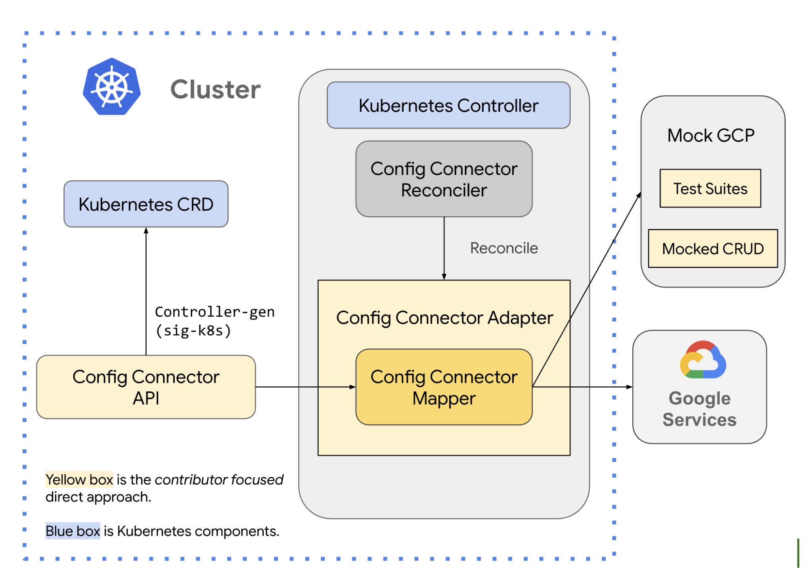

# Guide for Developing Config Connector Direct Resources 

We are thrilled to introduce the guide for adding Config Connector resources and fields! Resources built using this guide are called "Config Connector Direct Controllers" or "direct reconciliation", because they are built directly against the service API. Developing a new resource (or a new field) is much faster and more manageable using this new Direct Controller approach than previous approaches. We have changed some key resource reconciliation processes to be more reliable and Kubernetes-native. We have also made a revolutionary change to the test driven development and PR review process to improve test coverage for every field in a resource. 

While there is more work to be done to further improve the process of adding Config Connector resources, we believe the guide is now ready to be shared broadly, such that Google developers, partners, and customers can add Config Connector resources. We will continue improving this guide to make it simpler and easier to develop new Config Connector resources. Please stay tuned for the upcoming changes.

# Introduction

This diagram gives a concise overview of the direct reconciliation approach. It offers a high-level perspective, showing the relationship between key components.

The guide will walk you through adding each component (yellow box) using the Config Connector code-generation tools. The generated code will offer greater insight into the functionality of each component.  You might need to adjust the generated code to accommodate specific resource or GCP service requirements (for example, resources that don't allow user creation or aren't fully declarative as described in https://google.aip.dev/128).

Familiarity with Kubernetes is not required to develop Config Connector resources. However, if you're interested in learning more about Kubernetes CRDs or Controllers (blue box), please refer to https://kubernetes.io/.

#  How to use this guide

The [scenarios](./scenarios) section lists all the common scenarios you may want to contribute to Config Connector. Each scenario contains the tools and guided steps to establish your task. We recommend you use the following principles to find the scenario best suite your case, and get started from there. 

*  **Check the CRD:** Examine the latest [CRDs](https://github.com/GoogleCloudPlatform/k8s-config-connector/tree/master/crds). The version can be found from the file name. If the resource exists but is in Alpha (and therefore not yet in the [Config Connector API Reference](https://cloud.google.com/config-connector/docs/reference/overview)), follow the [Alpha to Beta promotion guide](./scenarios/alpha-to-beta.md). This may be the simplest solution.

* **File an issue (if no CRD exists):** If no CRD is found, you'll likely need to create a new resource. Before starting this process, check if an issue is already filed. If not, please file an issue to avoid duplication of effort and allow us to coordinate effectively. If you are willing to take the resource yourself, please assign the issue.

* **Prioritize the direct approach:** We are currently prioritizing the Direct approach over Terraform/DCL-based resource implementations.  If you encounter issues preventing the use of the direct approach, please let us know in the filed issue so we can assist.

The [api-conventions](./api-conventions) section is topic specific and focus on the Config Connector's solution on that topic.

The [deep-dives](./deep-dives) section gives you all the tools and exit criteria for a given step in each scenario. You may not need all of them to establish your task.

# Contents

## Develop by scenarios

* [Add a new resource](./scenarios/new-resource.md)
* [Add a new field](./scenarios/new-field.md)
* [Promote a Alpha Resource to Beta](./scenarios/alpha-to-beta.md)
* [Migrate a Terraform/DCL-based Resource to Direct (Alpha)](./scenarios/migrate-tf-resource-alpha.md)
* [Migrate a Terraform/DCL-based Resource to Direct (Beta)](./scenarios/migrate-tf-resource-beta.md)

## API conventions

* [Identification of the GCP resource](./api-conventions/external-reference.md)
* [Dependencies to other resources](./api-conventions/resource-reference.md)
* [CustomResource field validations](./api-conventions/validations.md)

## Deep-dives

This section gives a deep-dive about each step.

* [Add MockGCP tests](./deep-dives/1-add-mockgcp-tests.md)
* [Define API](./deep-dives/2-define-apis.md)
* [Add KRM and API Mapper](./deep-dives/3-add-mapper.md)
* [Add Controller](./deep-dives/4-add-controller.md)
* [Releases](./deep-dives/5-releases.md)