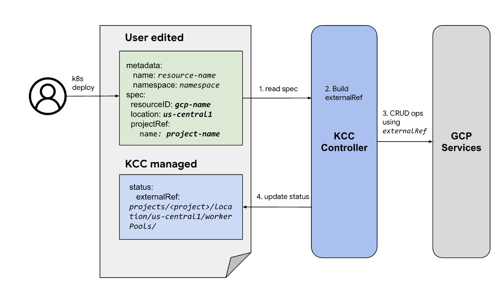

# Direct Resource External Reference Guide


# TL;DR

`status.externalRef` should be used as the GCP identifier of the Config Connector resource.


# Basic Rules

* Config Connector should assign the `status.externalRef` value when it initially acquires or creates the GCP resource.

* Config Connector should use `status.externalRef` as the GCP identifier to retrieve, update and delete (if applicable) the resource.

* Config Connector should validate the `spec` corresponding identifiers (i.e. `spec.projectRef` `spec.location`, `spec.resourceID`) based on `status.externalRef`.

* The `status.externalRef` value can be used as [the resource reference `<kind>Ref.External`](./resource-reference.md#api-rule)

* Config Connector shall not write the Direct resources' resource ID back to the `spec.resourceID` field. Only users should configure the `spec` fields.[^1]




# API definition

```
type <Kind>Status struct {
   /* A unique specifier for the <Kind> workerpool resource in GCP.*/
   ExternalRef *string json:"externalRef,omitempty"
   ...
}
```

## `status.externalRef` format

The `status.externalRef`  shall use the [cloud asset inventory](https://cloud.google.com/asset-inventory/docs/resource-name-format) as reference to build its value. The service domain can be omitted.

* If a resource has multiple asset inventory, we choose the newer one in the [resource name format](https://cloud.google.com/asset-inventory/docs/resource-name-format) list (normally the  bottom ones).
* If a resource is not supported in the asset inventory, we shall refer to the resources’ REST API references to use the resource path.

## Enhancement to the service-generated ID resource

* If a resource does not let user to specify the name or identifier, but its GCP service assigns an ID in the HTTP response, the Direct reconciler will use the service generated ID to build the `status.externalRef`, but **not write back to the `spec.resourceID`**. 

* If user specifies the service-generated ID in the `spec.resourceID` field, the Direct reconciler will acquire the resource if the `status.externalRef` is not assigned.

### Backward compatibility for TF/DCL based reconcilers

The existing TF-based and DCL-based reconciliation treats the `spec.resourceID` as the single Source of Truth to identify a GCP resource. It writes back the `spec.resourceID` after reconciliation. Here are [the known problems](https://github.com/GoogleCloudPlatform/k8s-config-connector/issues/2765). Config Connector will keep the bahavior of these resources, until they are migrated to the Direct reconciler.

<!-- Footnotes themselves at the bottom. -->

[^1]:
    Existing Terraform-based or DCL-based resources still have Config Connector written back to the `spec.resourceID` field for backward compatibility reasons.   

