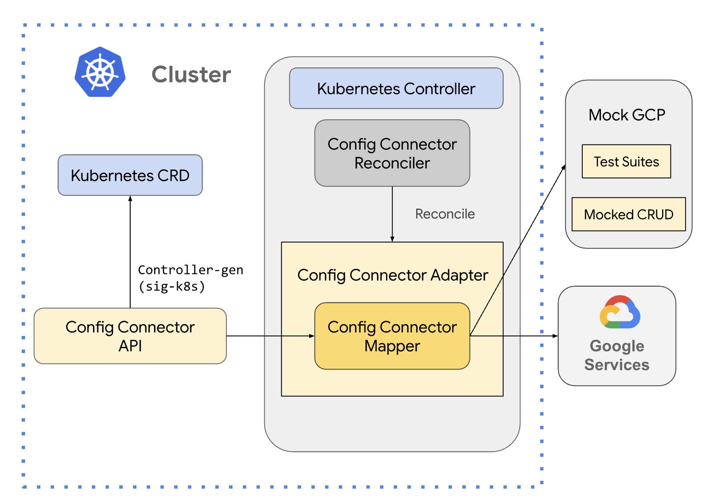

# Introduction of the Direct reconcile approach

This diagram gives a concise overview of the direct reconciliation approach. It offers a high-level perspective, showing the relationship between key components.

The guide will walk you through adding each component (yellow box) using the Config Connector code-generation tools. The generated code will offer greater insight into the functionality of each component.  You might need to adjust the generated code to accommodate specific resource or GCP service requirements (for example, resources that don't allow user creation or aren't fully declarative as described in https://google.aip.dev/128).

Familiarity with Kubernetes is not required to develop Config Connector resources. However, if you're interested in learning more about Kubernetes CRDs or Controllers (blue box), please refer to https://kubernetes.io/.

