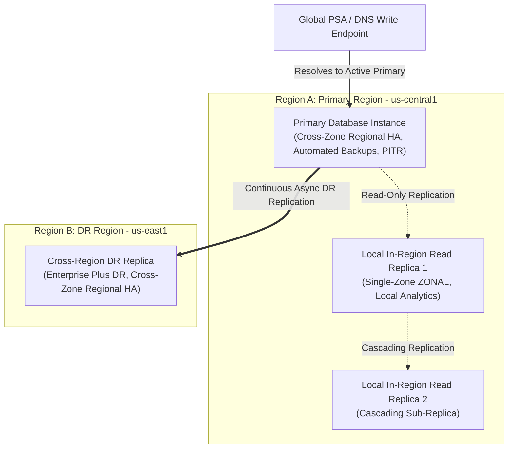

# Cloud SQL Enterprise DR — Testing & Verification Architecture

This document describes the multi-tiered test architecture, verification matrix, and operational failover test suites implemented for Cloud SQL Enterprise Disaster Recovery (DR) in Kubernetes Config Connector (KCC).

---

## 1. Overview & Multi-Tiered Architecture

Managing Cloud SQL Enterprise DR declaratively in Kubernetes requires synchronizing complex, distributed database topologies across multiple zones and regions while allowing Google Cloud replication mechanisms to operate autonomously.

A complete Cloud SQL Enterprise DR deployment consists of multiple architectural tiers:



### Topology Tier Definitions

| Tier | Resource Role | Configuration | Purpose |
| :--- | :--- | :--- | :--- |
| **Tier 1: In-Region Local Replica** | Read Replica (`READ_REPLICA_INSTANCE`) | `availabilityType: ZONAL`, `masterInstanceRef: primary` | Read-scaling and local analytics within the primary region. Does not participate in DR failovers. |
| **Tier 2: Cross-Zone Primary** | Active Primary (`CLOUD_SQL_INSTANCE`) | `availabilityType: REGIONAL`, `failoverDrReplicaRef: dr-replica`, Automated backups & PITR | Serves all read/write traffic across multiple availability zones in Region A. |
| **Tier 3: Cross-Region DR Replica** | Designated DR Replica (`READ_REPLICA_INSTANCE`) | `availabilityType: REGIONAL`, `masterInstanceRef: primary`, `failoverDrReplicaRef: dr-replica` | Cross-region failover target in Region B. Synchronized asynchronously with Tier 2 primary. |
| **Tier 4: Cascading Sub-Replicas** | Cascading Replica | `masterInstanceRef: local-replica` | Multi-tier reporting replicas replicating from Tier 1 local replicas. |

---

## 2. Three-Tiered Testing Strategy

To ensure robustness without regressions, Config Connector verifies Cloud SQL Enterprise DR across three independent layers of testing:

```
+-----------------------------------------------------------------------------+
| Layer 1: Direct Controller Unit & Mock Suite (sqlinstance_dr_test.go)       |
| -> Multi-Engine Matrix, Role Precedence, URI Parsing, Transient Error Requeue |
+-----------------------------------------------------------------------------+
                                       |
                                       v
+-----------------------------------------------------------------------------+
| Layer 2: E2E Fixtures & Golden Resource Tests (tests-e2e-fixtures-suite)    |
| -> CRD Schema Validation, MockSQL Reconciler, Golden Event Sequences        |
+-----------------------------------------------------------------------------+
                                       |
                                       v
+-----------------------------------------------------------------------------+
| Layer 3: Live Real-World GCP Integration Suite (sqlinstance_live_dr_test.go)|
| -> Live Cloud SQL Admin API, Multi-Zone HA Failover, Planned DR Switchovers |
+-----------------------------------------------------------------------------+
```

---

## 3. Test Suites & Coverage Matrix

### Layer 1: Direct Controller Engine Suite (`sqlinstance_dr_test.go`)

This suite runs directly against the in-memory Go direct controller and exercises core equality, status mapping, and lifecycle handling:

| Test Case | Scope & Verification |
| :--- | :--- |
| `TestDiffInstances_DR_RoleSwap_MultiEngine` | Verifies bidirectional diff suppression on `masterInstanceName`, `instanceType`, and `failoverDrReplicaName` across PostgreSQL, MySQL, and SQL Server. |
| `TestSQLInstanceStatus_CurrentRole_MasterInstancePrecedence` | **Runtime Role Precedence**: Asserts that whenever `MasterInstanceName != ""` on an instance, `status.currentRole` is strictly mapped as `DR_REPLICA` and never `PRIMARY`, even if `FailoverDrReplicaName` is also present. |
| `TestIsInstanceNameEqual_Formats` | **Structured URI Normalization**: Validates cross-format equality matching between short names (`db-replica`), colon paths (`project:db-replica`), slash paths (`projects/project/instances/db-replica`), and full REST URIs (`https://sqladmin.googleapis.com/...`). Guarantees cross-project comparisons strictly return `false`. |
| `TestSQLInstance_StandbyDuringFailover` | Verifies that when an instance enters `MAINTENANCE` or `UPDATING` with an active operation (such as `SWITCHOVER`), KCC yields mutating updates, sets `Ready=False, Reason=FailoverInProgress`, and requests a requeue. |
| `TestSQLInstance_StandbyDuringTransientOperationError` | **Transient Error Resilience**: Simulates an HTTP 500 error or API rate limit during `checkActiveOperations` when an instance is in `MAINTENANCE` or `UPDATING`. Asserts KCC safely enters standby (`FailoverInProgress`) and requeues without attempting a mutating update that triggers HTTP 409 Conflict. |
| `TestSQLInstance_DeletionBlockedDuringFailover` | Verifies that calling `Delete()` while an instance is undergoing a failover operation is blocked to prevent accidental data loss or corruption. |
| `TestSQLInstance_DeletionBlocked_TransientOperationError` | **Airtight Deletion Guard**: Asserts that calling `Delete()` while an instance is in `UPDATING` or `MAINTENANCE` returns an error if active operations cannot be verified, preventing unsafe deletions. |
| `TestDiffInstances_DR_BackupConfiguration_Suppression` | Verifies that during an active DR role swap, differences in `backupConfiguration` (automatically enabled on promoted primary, disabled on demoted replica) are cleanly suppressed to prevent HTTP 400 invalid update errors. |
| `TestDiffInstances_DR_ThreeTierTopology_SingleZone_CrossZone_CrossRegion` | Validates a full 3-tier production cluster: Single-Zone local replica, Cross-Zone HA primary, and Cross-Region DR replica. Confirms zero diffs across all nodes during role swap. |
| `TestDiffInstances_DR_ExhaustiveMatrix_AllEnginesAndVersions` | Validates all supported database engine versions: PostgreSQL (14, 15, 16), MySQL (8.0, 8.4), and SQL Server (2019, 2022). |
| `TestDiffInstances_DR_CascadingAndMultiReplicaTopology` | Validates multi-node topologies containing cascading sub-replicas, ensuring cascading pointers remain intact and unmutated during primary failovers. |
| `TestDiffInstances_DR_DecommissionFailoverDrReplica` | Ensures that when an operator deliberately removes `spec.replicationCluster.failoverDrReplicaRef` in Git (decommissioning DR), KCC detects the diff and reconciles it when not in an active role swap. |
| `TestDiffInstances_DR_LegitimateConfigDriftDetected` | Ensures that while role-swap fields are suppressed, legitimate configuration drift (tier upgrades, database flags, label additions) is immediately detected and reconciled. |
| `TestDiffInstances_DR_PublicIP_NoPSA` | Validates Enterprise DR diff suppression on topologies configured without Private Services Access (PSA) using authorized networks or public IPs. |

---

### Layer 2: E2E Golden Fixtures Suite (`tests-e2e-fixtures-suite`)

This suite runs against the Config Connector mock GCP server and verifies CRD validation rules, admission webhooks, and mock serialization:

- **CRD Schema Conformance**: Verifies that `spec.replicationCluster.failoverDrReplicaRef` and `status.currentRole` validate cleanly against OpenAPI v3 specifications.
- **MockSQL Replication Swap**: Tests end-to-end reconciliation cycles against `mockgcp` Cloud SQL emulation, verifying event logs, object transitions, and status conditions.

---

### Layer 3: Live Real-World GCP Integration Suite (`sqlinstance_live_dr_test.go`)

This suite executes against real Google Cloud SQL infrastructure to validate end-to-end platform behavior:

| Operational Mode | Trigger / Mechanism | Target Assertions in Real GCP |
| :--- | :--- | :--- |
| **Baseline Topology** | Live Cloud SQL Admin API query | `status.currentRole` projects `PRIMARY` for active primary and `DR_REPLICA` for cross-region replica. `status.observedState.replicationCluster.psaWriteEndpoint` projects the live `.sql-psa.goog.` DNS record. `DiffInstances` returns 0 diff. |
| **Mode 1: Zonal HA Failover** | `gcloud sql instances failover <primary>` | Instance enters `MAINTENANCE`. KCC detects in-flight operation and sets `Ready=False, Reason=FailoverInProgress`. Upon failover completion, KCC restores `Ready=True, Reason=FailoverAcknowledged`. `status.currentRole` remains `PRIMARY`. |
| **Mode 2: Planned DR Switchover** | `gcloud sql instances switchover <replica>` | Cloud SQL executes zero-data-loss role swap. KCC detects `SWITCHOVER` LRO, pauses mutations, inverts `status.currentRole` (`PRIMARY` <-> `DR_REPLICA`), and suppresses diffs against static Git manifests. |
| **Mode 2: Reverse Failback** | `gcloud sql instances switchover <primary>` | Reverse switchover restores original baseline roles cleanly without reconciliation drift or operator intervention. |
| **Mode 3: Emergency DR Promotion** | `gcloud sql instances promote-replica <replica>` | Simulates emergency promotion during primary outage. KCC promotes replica to `status.currentRole=PRIMARY`, cleans replica diffs, and guards against deletion while the promotion operation is active. |

---

## 4. Running the Test Suites

### Running Unit & Direct Controller Tests Locally
```bash
# Run the entire SQL direct controller suite with the Go race detector
go test -v -race ./pkg/controller/direct/sql/...

# Run specifically the Enterprise DR test suite
go test -v -race -run "TestDiffInstances_DR|TestSQLInstance" ./pkg/controller/direct/sql/...
```

### Running E2E Fixtures Tests
```bash
# Execute SQL direct controller E2E fixture suites
./dev/tasks/tests-e2e-fixtures-suite sql 0 2
./dev/tasks/tests-e2e-fixtures-suite sql 1 2
```

### Running Live GCP Integration Tests
```bash
# Set RUN_LIVE_GCP_TESTS=true and specify your target test project
export RUN_LIVE_GCP_TESTS=true
export PROJECT_ID="my-test-project"

# Run the live GCP verification suite
go test -v -run "TestLiveGCP" ./pkg/controller/direct/sql/...
```
