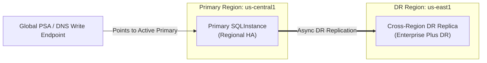

# Managing Cloud SQL Enterprise Disaster Recovery (DR) with GitOps & ArgoCD

This guide explains how to manage Google Cloud SQL Enterprise Plus Disaster Recovery (DR) using Config Connector (KCC), GitOps controllers (such as ArgoCD or Config Sync), and the Cloud SQL Admin API.

---

## 1. Overview & Architecture

Cloud SQL **Enterprise Plus edition** provides built-in, cross-region Disaster Recovery (DR) designed for mission-critical business continuity. A primary instance in Region A is paired with a designated cross-region DR replica in Region B.

Cloud SQL provides two primary DR operations:
1. **Planned Switchover**: A controlled, zero-data-loss role reversal between the primary and DR replica. Often used for routine disaster recovery testing or planned regional migrations.
2. **Emergency Failover**: An immediate promotion of the DR replica to primary status during an unexpected regional outage.



When a switchover or failover occurs in Cloud SQL:
- The DR replica in Region B is promoted to `PRIMARY`.
- The former primary in Region A is demoted to a replica pointing to Region B.
- The global write endpoint (`*.global.sql-psa.goog.`) is automatically repointed to the new primary.
- Applications experience zero connection string changes.

---

## 2. The GitOps Challenge & The KCC Solution

In traditional Infrastructure-as-Code (such as standard Terraform or naive Kubernetes operators), out-of-band failovers cause serious reconciliation drift:
- Live GCP instance roles invert (`masterInstanceName`, `instanceType`, `backupConfiguration`).
- GitOps controllers flag the resources as drifted (`OutOfSync`) and attempt to re-impose the original roles by mutating the instances.
- Because Cloud SQL Admin API rejects mutating `masterInstanceName` on existing instances, reconciliation fails into an infinite error loop or inadvertently breaks replication.

### KCC Autonomous Diff Suppression

Config Connector's Direct SQL Controller solves this declaratively by implementing **Enterprise DR Role-Swap Equality**:
- **Drift Suppression on Inverted Fields**: When a DR role swap is active, KCC automatically suppresses drift on `.masterInstanceName`, `.instanceType`, `.replicationCluster.failoverDrReplicaName`, and `.settings.backupConfiguration`.
- **Git Repository Stability**: The GitOps repository remains the single source of truth and does **not** need to be altered or scrambled during a disaster recovery drill.
- **Runtime Role Status Projection**: KCC projects the live replication role into `status.currentRole` (`PRIMARY` or `DR_REPLICA`), allowing platform engineers to monitor runtime topology without mutating `.spec`.
- **Preservation of Legitimate Drift**: Changes to machine tiers, labels, authorized networks, or database flags are **not** suppressed and continue to reconcile seamlessly.

---

## 3. Resource Specifications

### Primary Instance Manifest (`dr-primary.yaml`)

```yaml
apiVersion: sql.cnrm.cloud.google.com/v1beta1
kind: SQLInstance
metadata:
  name: sql-primary
  namespace: database
spec:
  databaseVersion: POSTGRES_16
  region: us-central1
  settings:
    tier: db-perf-optimized-N-2
    edition: ENTERPRISE_PLUS
    availabilityType: REGIONAL
    backupConfiguration:
      enabled: true
      pointInTimeRecoveryEnabled: true
      transactionLogRetentionDays: 7
    ipConfiguration:
      ipv4Enabled: false
      privateNetworkRef:
        name: enterprise-vpc
  replicationCluster:
    failoverDrReplicaRef:
      name: sql-dr-replica
```

### DR Replica Manifest (`dr-replica.yaml`)

```yaml
apiVersion: sql.cnrm.cloud.google.com/v1beta1
kind: SQLInstance
metadata:
  name: sql-dr-replica
  namespace: database
spec:
  databaseVersion: POSTGRES_16
  region: us-east1
  masterInstanceRef:
    name: sql-primary
  settings:
    tier: db-perf-optimized-N-2
    edition: ENTERPRISE_PLUS
    availabilityType: REGIONAL
    ipConfiguration:
      ipv4Enabled: false
      privateNetworkRef:
        name: enterprise-vpc
```

> [!NOTE]
> In accordance with Cloud SQL Enterprise DR API specifications, `replicationCluster.failoverDrReplicaRef` is designated only on the primary instance, while the DR replica declares its relationship via `masterInstanceRef`.

---

## 4. Lifecycle Conditions & Status Monitoring

Config Connector communicates the state of Cloud SQL DR operations via standard Kubernetes resource conditions and status fields:

| Condition | Status | Reason | Meaning |
| :--- | :--- | :--- | :--- |
| `Ready` | `False` | `FailoverInProgress` | Cloud SQL is actively executing a `SWITCHOVER`, `FAILOVER`, or `PROMOTE_REPLICA` operation. KCC enters a non-blocking standby loop. |
| `Ready` | `True` | `FailoverAcknowledged` | The failover operation has completed successfully. KCC has acknowledged the new replication topology and resumed standard orchestration. |
| `Ready` | `True` | `UpToDate` | The resource matches desired declarative intent. |

### Inspecting Runtime Role

To check the current operational role of an instance without inspecting GCP console:

```bash
kubectl get sqlinstance -n database -o custom-columns=\
NAME:.metadata.name,\
REGION:.spec.region,\
ROLE:.status.currentRole,\
READY:.status.conditions[0].status,\
REASON:.status.conditions[0].reason
```

Example output during normal operations:
```
NAME            REGION        ROLE         READY   REASON
sql-primary     us-central1   PRIMARY      True    UpToDate
sql-dr-replica  us-east1      DR_REPLICA   True    UpToDate
```

Example output post-switchover:
```
NAME            REGION        ROLE         READY   REASON
sql-primary     us-central1   DR_REPLICA   True    FailoverAcknowledged
sql-dr-replica  us-east1      PRIMARY      True    FailoverAcknowledged
```

---

## 5. ArgoCD Configuration & Best Practices

When deploying Cloud SQL Enterprise DR with ArgoCD, use the following recommendations:

### ArgoCD Application Manifest

```yaml
apiVersion: argoproj.io/v1alpha1
kind: Application
metadata:
  name: enterprise-database
  namespace: argocd
spec:
  project: default
  source:
    repoURL: https://github.com/my-org/gitops-infra.git
    targetRevision: HEAD
    path: environments/production/cloudsql
  destination:
    server: https://kubernetes.default.svc
    namespace: database
  syncPolicy:
    automated:
      prune: false # Prevent accidental deletion during regional drills
      selfHeal: true
    syncOptions:
      - CreateNamespace=true
      - ApplyOutOfSyncOnly=true
```

### Why Custom `ignoreDifferences` Is NOT Required

Because Config Connector's direct SQL controller natively suppresses diffs for `instanceType`, `masterInstanceName`, `failoverDrReplicaName`, and `backupConfiguration` when an Enterprise DR role swap is detected, the resource status reported to the Kubernetes API server reflects an in-sync state. You do **not** need complex ArgoCD `ignoreDifferences` rules in your `Application` spec.

---

## 6. Operational Runbooks

### Runbook 1: Performing a Routine Planned DR Drill (Zero Data Loss)

1. **Initiate Switchover in GCP**:
   Execute the switchover from the Google Cloud CLI or Cloud Console:
   ```bash
   gcloud sql instances switchover sql-primary
   ```
2. **Observe KCC Standby**:
   While Cloud SQL is performing the role swap, KCC marks both resources with `Reason=FailoverInProgress` and avoids sending conflicting mutations.
3. **Verify Post-Switchover State**:
   Once Cloud SQL completes the operation:
   - `sql-dr-replica` reports `status.currentRole: PRIMARY` and `Reason: FailoverAcknowledged`.
   - `sql-primary` reports `status.currentRole: DR_REPLICA` and `Reason: FailoverAcknowledged`.
   - ArgoCD remains green (`Synced` / `Healthy`).
4. **Conduct Synthetic Application Verification**:
   Verify application connectivity and write capability to the global write endpoint.
5. **Restore Baseline Topology (Switchback)**:
   Trigger switchover on the newly promoted instance to restore original roles:
   ```bash
   gcloud sql instances switchover sql-dr-replica
   ```
   KCC transitions both resources back to `UpToDate` with original roles restored.

---

### Runbook 2: Emergency Regional Failover

If the primary region experiences an outage:
1. **Trigger Emergency Failover**:
   ```bash
   gcloud sql instances failover sql-primary
   ```
2. **Deletion Protection**:
   Config Connector intercepts and rejects any `Delete` requests on the resources while failover operations are in flight, preventing catastrophic split-brain or orphaned disks.
3. **Application Routing**:
   The Cloud SQL write endpoint points to `sql-dr-replica` in the surviving region.

---

### Runbook 3: Decommissioning or Migrating a DR Replica

To replace or decommission a DR replica (e.g. migrating to a different region):
1. **Edit the Primary Manifest in Git**:
   Remove `replicationCluster.failoverDrReplicaRef`:
   ```yaml
   spec:
     # replicationCluster:
     #   failoverDrReplicaRef: ...
   ```
2. **Commit and Sync via GitOps**:
   KCC recognizes that the instance is in a normal (non-role-swap) state, detects that `failoverDrReplicaName` has been removed, and instructs Cloud SQL to decommission the DR replica designation.
3. **Safe Deletion**:
   Once the DR replica designation is cleared, the replica can be safely updated or deleted.

---

## 7. Multi-Region Security & Network Best Practices

### Customer-Managed Encryption Keys (CMEK)
- Cloud KMS keys are strictly regional. A key in `us-central1` cannot encrypt persistent disks in `us-east1`.
- The primary instance must reference a KMS key in Region A:
  ```yaml
  encryptionKMSCryptoKeyRef:
    external: projects/my-kms-proj/locations/us-central1/keyRings/sql-ring/cryptoKeys/primary-key
  ```
- The DR replica must reference a KMS key in Region B:
  ```yaml
  encryptionKMSCryptoKeyRef:
    external: projects/my-kms-proj/locations/us-east1/keyRings/sql-ring/cryptoKeys/replica-key
  ```
- Each instance maintains its regional key across failovers. KCC does not attempt to swap KMS keys between instances.

### Private Service Connect (PSC)
- When using PSC instead of Private Service Access (PSA), `psaWriteEndpoint` is empty.
- Client connectivity during failovers should be directed using Cloud DNS Routing Policies (Failover or Geolocation routing) pointing to the PSC endpoint in each region.
- KCC exposes `status.pscServiceAttachmentLink` and `status.dnsName` on each instance for automated integration.
